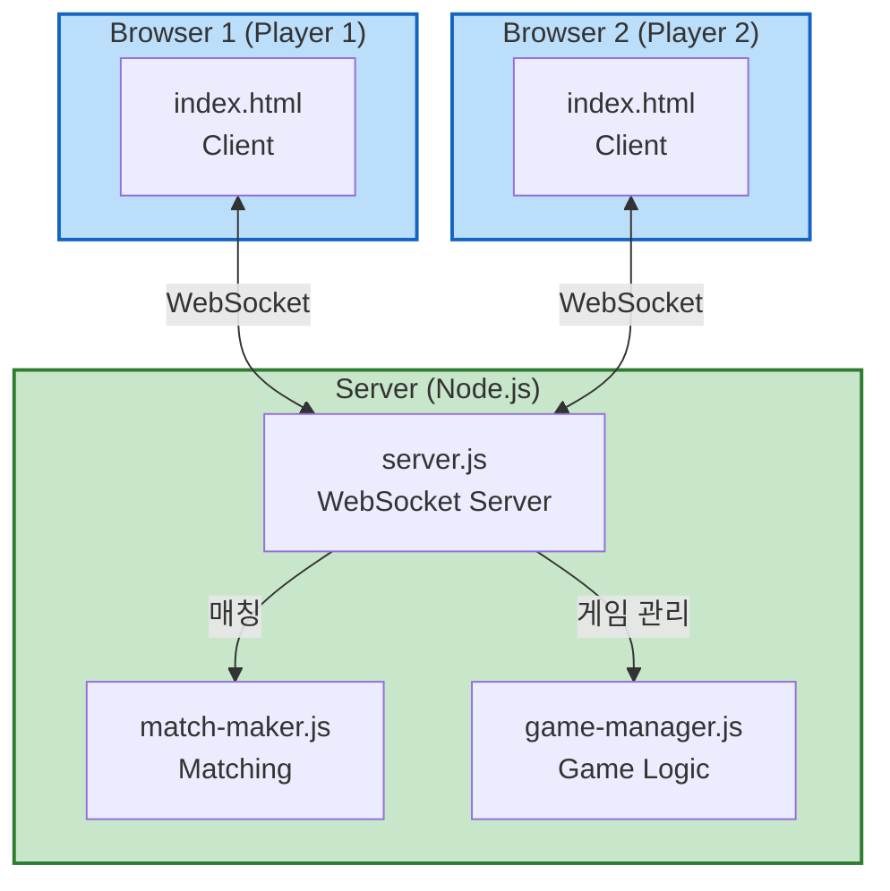

# Application Design - 통합 문서

## 문서 개요

이 문서는 멀티플레이어 카드 배틀 게임의 전체 애플리케이션 설계를 통합하여 제공합니다.

**프로젝트**: 단일 플레이어 게임 → 멀티플레이어 게임 전환
**아키텍처**: 클라이언트 전용 → 클라이언트-서버 분리
**통신**: WebSocket (Socket.io)

---

## 목차

1. [설계 개요](#설계-개요)
2. [아키텍처](#아키텍처)
3. [컴포넌트](#컴포넌트)
4. [컴포넌트 메서드](#컴포넌트-메서드)
5. [서비스](#서비스)
6. [컴포넌트 의존성](#컴포넌트-의존성)
7. [설계 결정](#설계-결정)
8. [확장성 고려사항](#확장성-고려사항)

---

## 설계 개요

### 프로젝트 목표
- 기존 단일 플레이어 게임에 멀티플레이어 기능 추가
- 1:1 실시간 대전 지원
- FIFO 방식 자동 매칭
- AI 모드 유지 (선택 가능)

### 주요 변경사항
| Before | After |
|--------|-------|
| 클라이언트 전용 | 클라이언트 + 서버 |
| 단일 HTML 파일 | HTML + 서버 모듈 3개 |
| 로컬 게임 로직 | 서버 사이드 검증 + 동기화 |
| 브라우저 메모리 | 서버 메모리 (게임 세션) |

### 기술 스택
**Server**:
- Node.js (v18+)
- Express.js (v4.x)
- Socket.io (v4.x)

**Client**:
- HTML5, CSS3, Vanilla JavaScript
- Socket.io-client (v4.x)

**Architecture**: Event-Driven, Real-time

---

## 아키텍처

### 시스템 아키텍처



### 계층 구조

```
┌─────────────────────────────────┐
│   Presentation Layer (Client)   │ ← UI, User Interaction
├─────────────────────────────────┤
│   Communication Layer           │ ← WebSocket (Socket.io)
├─────────────────────────────────┤
│   Business Logic Layer (Server) │ ← Game Logic, Validation
├─────────────────────────────────┤
│   Data Layer (Server)           │ ← In-Memory State
└─────────────────────────────────┘
```

---

## 컴포넌트

### 전체 컴포넌트 목록

| # | Component | Module | Layer | Responsibility |
|---|-----------|--------|-------|----------------|
| 1 | WebSocket Server | server.js | Server | 연결 관리, 이벤트 라우팅 |
| 2 | Match Maker | match-maker.js | Server | 매칭 큐, FIFO 매칭 |
| 3 | Game Manager | game-manager.js | Server | 게임 로직, 상태 관리 |
| 4 | Mode Selector | index.html | Client | AI/멀티플레이어 선택 |
| 5 | WebSocket Client | index.html | Client | 서버 통신 |
| 6 | UI Renderer | index.html | Client | 화면 렌더링 |
| 7 | Local AI | index.html | Client | AI 대전 상대 |
| 8 | Data Models | Shared | Shared | 데이터 구조 |
| 9 | Protocol | Shared | Shared | 이벤트 스펙 |

**Total**: 9 components (Server: 3, Client: 4, Shared: 2)

### 컴포넌트 다이어그램

상세 다이어그램은 `components.md` 참조.

---

## 컴포넌트 메서드

### 주요 서버 메서드

**MatchMaker**:
- `addPlayerToQueue(socketId)` - 큐에 추가, 매칭 시도
- `removePlayerFromQueue(socketId)` - 큐에서 제거

**GameManager**:
- `createGame(player1, player2, io)` - 게임 생성 및 초기화
- `handleCardSubmit(gameId, playerId, cardIndex, io)` - 카드 제출 처리
- `compareCards(card1, card2)` - 배틀 판정
- `startTurnTimer(gameId, playerId, io)` - 턴 타이머 시작
- `handleDisconnect(socketId, io)` - 연결 끊김 처리
- `handleEmoji(gameId, playerId, emoji, io)` - 이모티콘 처리

### 주요 클라이언트 메서드

**Mode Selector**:
- `showModeSelection()` - 모드 선택 화면 표시
- `selectAIMode()` - AI 모드 선택
- `selectMultiplayerMode()` - 멀티플레이어 선택

**WebSocket Client**:
- `initializeWebSocket(serverUrl)` - 소켓 연결
- `emitCardSubmit(cardIndex)` - 카드 제출 이벤트 전송
- `handleGameStart(data)` - 게임 시작 이벤트 처리
- `handleTurnResult(data)` - 턴 결과 처리

**UI Renderer**:
- `renderPlayerHand(hand)` - 플레이어 패 렌더링
- `renderTimer(remainingTime)` - 타이머 표시
- `showEmojiAnimation(emoji)` - 이모티콘 애니메이션

상세 메서드 시그니처는 `component-methods.md` 참조.

**Total Methods**: 39 (Server: 19, Client: 20)

---

## 서비스

### 서비스 레이어 개요

**서버 사이드**:
1. **Matching Service** (MatchMaker) - 플레이어 매칭
2. **Game Session Service** (GameManager) - 게임 로직 및 상태
3. **Timer Service** (GameManager 내부) - 턴 타이머

**클라이언트 사이드**:
4. **WebSocket Communication Service** - 서버 통신
5. **Game State Management Service** - 클라이언트 상태
6. **UI Rendering Service** - 화면 렌더링

### 서비스 오케스트레이션

**Multiplayer Flow**:
```
1. Client: player:join 전송
2. Server: MatchMaker.addPlayerToQueue()
3. MatchMaker: 2명 매칭 완료
4. Server: GameManager.createGame()
5. Server: game:start 이벤트 브로드캐스트
6. Clients: 게임 화면 렌더링
7. Loop: 카드 제출 → 배틀 판정 → 결과 표시
8. Server: 게임 종료 조건 확인
9. Server: game:end 이벤트 브로드캐스트
```

상세 시퀀스 다이어그램은 `services.md` 참조.

---

## 컴포넌트 의존성

### 의존성 매트릭스

**서버 사이드**:
- WebSocket Server → MatchMaker (매칭 요청)
- WebSocket Server → GameManager (게임 관리)
- MatchMaker ↔ GameManager: **독립적**

**클라이언트 사이드**:
- Mode Selector → WebSocket Client (멀티플레이어 모드)
- Mode Selector → Local AI (AI 모드)
- WebSocket Client → UI Renderer (화면 업데이트)
- Local AI → UI Renderer (화면 업데이트)

**Cross-Layer**:
- WebSocket Client ↔ WebSocket Server (Socket.io)

### 결합도 평가

| Layer | Coupling Level | Assessment |
|-------|----------------|------------|
| **Server Internal** | Low | ✅ Good (독립적 모듈) |
| **Client Internal** | Low-Medium | ✅ Acceptable (순수 함수 활용) |
| **Cross-Layer** | Loose | ✅ Good (이벤트 프로토콜) |

상세 의존성 다이어그램은 `component-dependency.md` 참조.

---

## 설계 결정

### 주요 설계 결정 사항

#### 1. 서버 컴포넌트 구조
**결정**: 모듈화 (server.js, match-maker.js, game-manager.js)

**근거**:
- 책임 분리 (SRP)
- 유지보수성 향상
- 테스트 용이성

---

#### 2. 게임 세션 저장소
**결정**: 인메모리 Map 객체 (`gameId → GameState`)

**근거**:
- 간단한 구현
- 프로토타입 수준에 적합
- 빠른 조회 (O(1))

**Trade-off**:
- ❌ 서버 재시작 시 데이터 손실
- ✅ 추가 인프라 불필요

---

#### 3. 매칭 큐 구현
**결정**: 배열 기반 FIFO (`Array.push() / Array.shift()`)

**근거**:
- 간단한 구현
- FIFO 보장
- JavaScript 내장 메서드 활용

---

#### 4. 타이머 관리
**결정**: `setTimeout` 기반

**근거**:
- 간단한 구현
- 각 턴마다 독립적인 타이머
- 취소 용이 (clearTimeout)

---

#### 5. 클라이언트 WebSocket 통신
**결정**: index.html 내부에 통합

**근거**:
- 최소 변경 원칙 준수
- 요구사항: "기존 index.html 유지, WebSocket 통신만 추가"
- 프로토타입 속도 우선

**Trade-off**:
- ❌ 파일이 길어짐 (~700-800 LOC 예상)
- ✅ 파일 수 최소화, 배포 간단

---

#### 6. 에러 핸들링 전략
**결정**: 기본 에러 처리 (`console.error` + 사용자 알림)

**근거**:
- 프로토타입 수준
- 빠른 구현
- 복잡한 에러 핸들링 불필요

---

#### 7. 게임 상태 동기화
**결정**: 이벤트 기반 실시간 동기화

**근거**:
- 카드 게임은 실시간성 중요
- WebSocket의 장점 활용
- 폴링보다 효율적

---

#### 8. 카드 데이터 관리
**결정**: 서버에서만 덱 생성 및 배분

**근거**:
- 보안 (클라이언트 조작 방지)
- 서버가 단일 진실 공급원
- 치팅 방지

---

#### 9. AI 모드 처리
**결정**: 클라이언트 전용 (서버 접속 안 함)

**근거**:
- 기존 AI 로직 재사용
- 서버 부하 감소
- 오프라인 플레이 가능

---

#### 10. 이모티콘 전송
**결정**: 단순 이벤트 (`emoji:send` / `emoji:received`)

**근거**:
- 간단한 구현
- 5개 이모티콘만 지원
- 복잡한 채팅 시스템 불필요

---

## WebSocket 프로토콜

### 이벤트 스펙

**Client → Server**:
- `player:join` - 매칭 큐 진입
- `card:submit { gameId, cardIndex }` - 카드 제출
- `emoji:send { gameId, emoji }` - 이모티콘 전송

**Server → Client**:
- `match:found { gameId }` - 매칭 완료
- `game:start { gameId, hand, isFirstPlayer }` - 게임 시작
- `turn:result { playerCard, opponentCard, winner, HP }` - 턴 결과
- `game:end { winner, reason }` - 게임 종료
- `timer:tick { remainingTime }` - 타이머 업데이트
- `emoji:received { emoji }` - 이모티콘 수신
- `opponent:disconnected` - 상대방 연결 끊김

상세 페이로드는 `component-methods.md` 및 `requirements.md` 참조.

---

## 데이터 모델

### Card
```javascript
{
  suit: string,      // '♠', '♥', '♦', '♣'
  rank: string,      // 'A', '2'-'10', 'J', 'Q', 'K'
  value: number      // 1-13
}
```

### Game State (Server)
```javascript
{
  gameId: string,
  player1: {
    socketId: string,
    hand: Array<Card>,
    hp: number,
    submittedCard: Card | null
  },
  player2: { ... },
  turn: number,
  currentPlayer: 1 | 2,
  turnTimer: Timeout | null,
  status: 'waiting' | 'playing' | 'ended'
}
```

### Client State
```javascript
{
  gameMode: 'ai' | 'multiplayer',
  gameId: string,
  myHand: Array<Card>,
  myHp: number,
  opponentHp: number,
  turn: number,
  isMyTurn: boolean,
  remainingTime: number
}
```

---

## 확장성 고려사항

### 현재 설계 제약

1. **동시 사용자 수**: 10명 미만 (요구사항)
2. **게임 저장**: 인메모리만 (데이터베이스 없음)
3. **서버 인스턴스**: 단일 인스턴스
4. **보안**: 최소 수준 (기본 검증만)

### 향후 확장 가능성

#### Scalability
**현재 제약**:
- 인메모리 저장소 → 서버 재시작 시 데이터 손실
- 단일 인스턴스 → 수평 확장 불가

**확장 방안**:
1. **Redis 도입** - 게임 세션 저장소를 Redis로 이전
   - 여러 서버 인스턴스 간 상태 공유
   - 영속성 확보
2. **로드 밸런서** - Nginx 또는 AWS ALB
   - Socket.io sticky session 지원 필요
3. **클러스터링** - PM2 cluster mode
   - CPU 코어별로 인스턴스 실행

---

#### Feature Expansion
향후 추가 가능한 기능:

1. **사용자 인증** - 로그인 시스템
2. **게임 기록** - 데이터베이스에 승/패 저장
3. **리더보드** - 순위표
4. **방 생성** - 친구와 비공개 게임
5. **관전 모드** - 다른 게임 시청
6. **텍스트 채팅** - 전체 채팅 시스템
7. **게임 규칙 커스터마이징** - 카드 수, HP, 시간 제한 변경

---

#### Code Refactoring
향후 리팩토링 고려사항:

1. **클라이언트 파일 분리**
   - `index.html` → HTML만
   - `game-client.js` → 게임 로직
   - `socket-client.js` → WebSocket 통신
   - `ui-renderer.js` → UI 렌더링

2. **타입스크립트 전환**
   - 타입 안전성 향상
   - IDE 자동완성 개선

3. **테스트 추가**
   - Jest - 유닛 테스트
   - Supertest - API 테스트
   - Cypress - E2E 테스트

4. **에러 핸들링 강화**
   - 구조화된 에러 처리
   - 에러 로깅 시스템

---

## 설계 검증

### 요구사항 충족 여부

| 요구사항 | 설계 충족 | 관련 컴포넌트 |
|---------|----------|--------------|
| **FR-1: 게임 모드 선택** | ✅ | Mode Selector |
| **FR-2: FIFO 매칭** | ✅ | Match Maker |
| **FR-3: 게임 규칙 유지** | ✅ | Game Manager |
| **FR-4: 10초 턴 제한** | ✅ | Timer Service |
| **FR-5: 실시간 동기화** | ✅ | WebSocket Client/Server |
| **FR-6: 연결 끊김 처리** | ✅ | Game Manager.handleDisconnect |
| **FR-7: 게임 기록 없음** | ✅ | 인메모리만 사용 |
| **FR-8: 이모티콘** | ✅ | Game Manager.handleEmoji |
| **NFR-1: 응답 시간** | ✅ | 이벤트 기반 아키텍처 |
| **NFR-2: 확장성** | ✅ | 소규모 설계 |
| **NFR-3: 보안** | ✅ | 서버 사이드 검증 |
| **NFR-4: 로컬 배포** | ✅ | IP 자동 감지 |
| **TR-1: Node.js + Socket.io** | ✅ | 기술 스택 선정 |
| **TR-2: 최소 변경** | ✅ | index.html 유지 |
| **TR-3: WebSocket 프로토콜** | ✅ | 이벤트 스펙 정의 |

**충족률**: 14/14 (100%) ✅

---

## 설계 품질 평가

### 품질 속성

| 속성 | 평가 | 근거 |
|------|------|------|
| **유지보수성** | ⭐⭐⭐⭐ (Good) | 모듈화, 낮은 결합도 |
| **테스트 용이성** | ⭐⭐⭐ (Acceptable) | 독립 컴포넌트, Mock 가능 |
| **확장성** | ⭐⭐⭐ (Acceptable) | 소규모 설계, 확장 경로 존재 |
| **성능** | ⭐⭐⭐⭐ (Good) | 이벤트 기반, 인메모리 |
| **보안** | ⭐⭐ (Basic) | 최소 보안 (프로토타입) |
| **가독성** | ⭐⭐⭐⭐ (Good) | 명확한 네이밍, 간단한 구조 |

**종합 평가**: **⭐⭐⭐ (Good for Prototype)**

---

## 설계 문서 참조

1. **components.md** - 전체 컴포넌트 정의 및 책임
2. **component-methods.md** - 메서드 시그니처 (39개)
3. **services.md** - 서비스 레이어 및 오케스트레이션
4. **component-dependency.md** - 의존성 및 통신 패턴

---

## 설계 승인

**날짜**: 2026-05-13
**설계자**: AI-DLC (Claude Sonnet 4.5)
**검토자**: (사용자 승인 대기)
**상태**: Pending Approval

---

## 다음 단계

1. ✅ Application Design (현재)
2. ⏭️ Units Generation - 2개 유닛 생성 (서버, 클라이언트)
3. ⏭️ Code Generation - 코드 구현
4. ⏭️ Build and Test - 통합 테스트

**예상 타임라인**: Application Design 완료 → Units Generation (15분) → Code Generation (4~6시간) → Build and Test (1~2시간)
