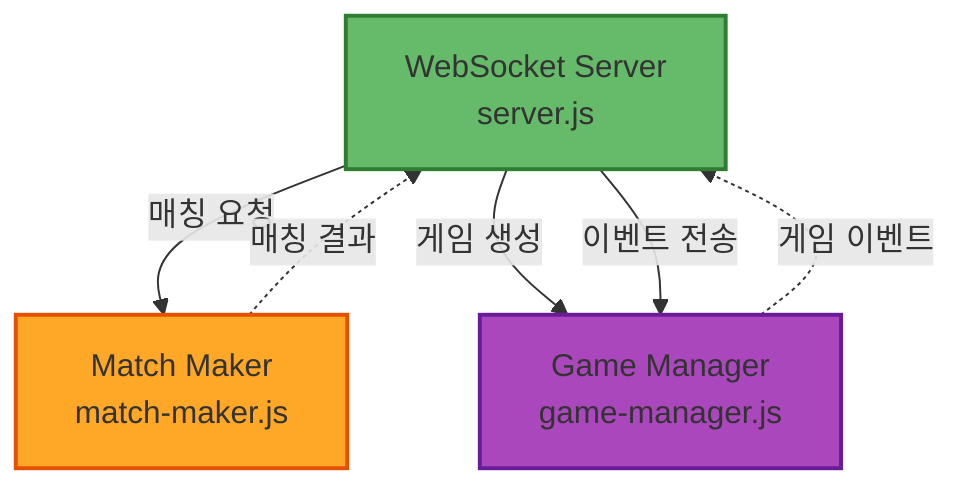
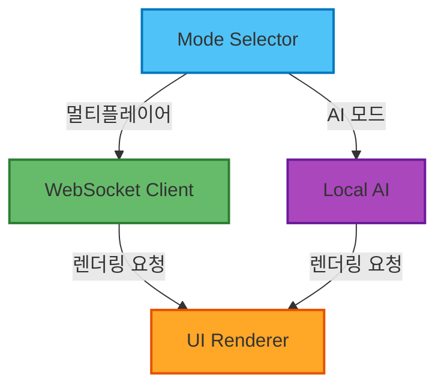
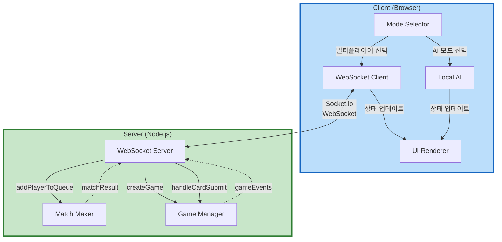
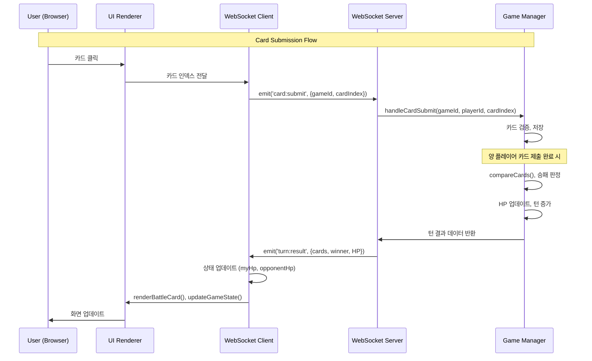
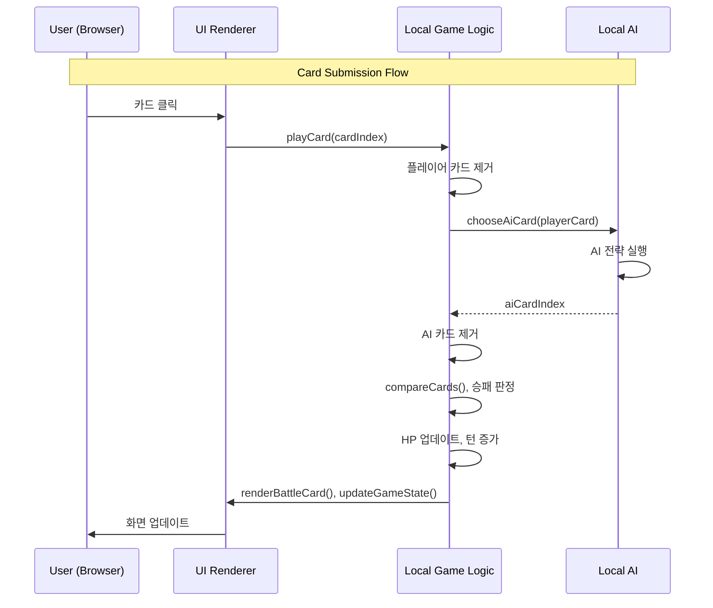

# Component Dependencies

## Overview
이 문서는 컴포넌트 간 의존성 관계, 통신 패턴, 데이터 플로우를 정의합니다.

---

## Dependency Matrix

### Server-Side Dependencies

| Component | Depends On | Used By | Coupling |
|-----------|------------|---------|----------|
| **WebSocket Server** | MatchMaker, GameManager | (Entry Point) | Medium |
| **Match Maker** | - | WebSocket Server | Low |
| **Game Manager** | - | WebSocket Server | Low |

**Notes**:
- MatchMaker와 GameManager는 독립적 (서로 의존하지 않음)
- WebSocket Server가 조정자(Orchestrator) 역할
- 낮은 결합도 (Loose Coupling) 유지

---

### Client-Side Dependencies

| Component | Depends On | Used By | Coupling |
|-----------|------------|---------|----------|
| **Mode Selector** | WebSocket Client, Local AI | - | Low |
| **WebSocket Client** | UI Renderer | Mode Selector | Medium |
| **UI Renderer** | - | WebSocket Client, Local AI | Low |
| **Local AI** | UI Renderer | Mode Selector | Low |

**Notes**:
- Mode Selector가 진입점 (라우터 역할)
- UI Renderer는 순수 렌더링 (의존성 없음)
- WebSocket Client와 Local AI는 독립적

---

### Cross-Layer Dependencies (Client ↔ Server)

| Client Component | Server Component | Protocol | Direction |
|------------------|------------------|----------|-----------|
| **WebSocket Client** | **WebSocket Server** | Socket.io | Bidirectional |

**Communication**: WebSocket 이벤트 기반

---

## Dependency Diagram

### Server-Side Dependencies



**Legend**:
- Solid Arrow (→): 직접 메서드 호출
- Dashed Arrow (-.->): 반환 값 또는 콜백

---

### Client-Side Dependencies



---

### Full System Dependencies



---

## Communication Patterns

### 1. WebSocket Event Communication

**Pattern**: Event-Driven, Bidirectional

**Client → Server Events**:
```javascript
// 매칭 큐 진입
socket.emit('player:join')

// 카드 제출
socket.emit('card:submit', { gameId, cardIndex })

// 이모티콘 전송
socket.emit('emoji:send', { gameId, emoji })
```

**Server → Client Events**:
```javascript
// 매칭 완료
socket.emit('match:found', { gameId })

// 게임 시작
socket.emit('game:start', { gameId, hand, isFirstPlayer })

// 턴 결과
socket.emit('turn:result', { playerCard, opponentCard, winner, HP })

// 게임 종료
socket.emit('game:end', { winner, reason })

// 타이머 업데이트
socket.emit('timer:tick', { remainingTime })

// 이모티콘 수신
socket.emit('emoji:received', { emoji })

// 상대방 연결 끊김
socket.emit('opponent:disconnected')
```

**Communication Flow**:
```
Client → socket.emit(event, data)
→ Network (WebSocket)
→ Server receives event
→ Server processes (calls service method)
→ Server emits response
→ Network (WebSocket)
→ Client receives event
→ Client handler processes
```

---

### 2. Service-to-Service Communication (Server)

**Pattern**: Direct Method Calls

**Example 1: Matching Flow**
```javascript
// server.js
socket.on('player:join', (socket) => {
  const matchResult = matchMaker.addPlayerToQueue(socket.id);
  
  if (matchResult) {
    const gameId = gameManager.createGame(
      matchResult.player1,
      matchResult.player2,
      io
    );
  }
});
```

**Example 2: Game Logic Flow**
```javascript
// server.js
socket.on('card:submit', (data) => {
  gameManager.handleCardSubmit(
    data.gameId,
    socket.id,
    data.cardIndex,
    io
  );
});
```

**Characteristics**:
- Synchronous method calls
- Direct dependencies
- Simple and straightforward

---

### 3. Component-to-Renderer Communication (Client)

**Pattern**: Function Calls (Imperative)

**Example**:
```javascript
// WebSocket event handler
socket.on('game:start', (data) => {
  myHand = data.hand;
  gameId = data.gameId;
  
  // UI 업데이트
  renderPlayerHand(myHand);
  updateGameState({ hp: 10, turn: 1 });
});
```

**Characteristics**:
- UI Renderer는 순수 함수 (상태 없음)
- Caller가 상태 관리
- 단방향 의존성 (WebSocketClient → UIRenderer)

---

## Data Flow

### Multiplayer Game Data Flow



---

### AI Mode Data Flow (Local)



---

## Coupling Analysis

### Server-Side Coupling

**WebSocket Server ↔ MatchMaker**: Loose
- Interface: `addPlayerToQueue(socketId)`
- Communication: Simple method call
- MatchMaker는 WebSocket Server를 알지 못함
- 단방향 의존성

**WebSocket Server ↔ GameManager**: Loose
- Interface: `createGame(player1, player2, io)`, `handleCardSubmit(...)`
- Communication: Method calls with callback (io)
- GameManager는 io 인스턴스를 사용하지만 WebSocket Server 구조는 몰라도 됨
- 단방향 의존성

**MatchMaker ↔ GameManager**: None
- 완전히 독립적
- 서로 알지 못함
- WebSocket Server가 중재

**Overall Server Coupling**: Low (Good)

---

### Client-Side Coupling

**Mode Selector ↔ WebSocket Client**: Loose
- Mode Selector가 WebSocket Client를 초기화만 함
- 이후 독립적으로 동작

**Mode Selector ↔ Local AI**: Loose
- Mode Selector가 Local AI 게임을 시작만 함
- 이후 독립적으로 동작

**WebSocket Client ↔ UI Renderer**: Medium
- WebSocket Client가 UI Renderer 함수를 자주 호출
- 하지만 UI Renderer는 순수 함수 (상태 없음)
- 테스트 가능

**Local AI ↔ UI Renderer**: Medium
- Local AI가 UI Renderer 함수를 자주 호출
- 동일하게 순수 함수 호출

**WebSocket Client ↔ Local AI**: None
- 완전히 독립적
- 서로 다른 모드에서 동작

**Overall Client Coupling**: Low to Medium (Acceptable)

---

### Cross-Layer Coupling

**Client ↔ Server**: Loose
- Interface: WebSocket 이벤트 프로토콜
- 명확한 계약(Contract): 이벤트 이름 및 페이로드 구조
- 양쪽 독립적으로 테스트 가능
- 프로토콜 변경 시 양쪽 모두 업데이트 필요 (단점)

**Protocol Coupling**: Medium
- WebSocket 이벤트 스펙에 의존
- 변경 시 영향 범위: 클라이언트 + 서버
- 하지만 Socket.io가 안정적이므로 문제 없음

---

## Dependency Injection

**Current Approach**: No formal DI (프로토타입이므로)

**Dependencies Passed**:
- `io` (Socket.io 서버 인스턴스) → GameManager 메서드에 전달
- 간단한 수동 의존성 주입

**Example**:
```javascript
// server.js
const matchMaker = new MatchMaker();
const gameManager = new GameManager();

// GameManager에 io를 전달 (수동 DI)
socket.on('card:submit', (data) => {
  gameManager.handleCardSubmit(data.gameId, socket.id, data.cardIndex, io);
});
```

**Why No Formal DI?**
- 프로토타입 수준
- 의존성이 적음 (3-4개)
- 복잡도 대비 이득 적음
- 향후 필요 시 리팩토링 가능

---

## Communication Protocols

### WebSocket Event Protocol

**Event Naming Convention**:
- `<entity>:<action>` 형식
- 예: `player:join`, `card:submit`, `game:start`

**Payload Structure**:
```javascript
{
  // Required fields
  gameId: string,  // (대부분의 이벤트)
  
  // Event-specific fields
  ...
}
```

**Error Handling**:
```javascript
// Server → Client error event
socket.emit('error', {
  code: 'INVALID_CARD',
  message: '유효하지 않은 카드입니다'
});
```

---

### HTTP Protocol (Static Files)

**Purpose**: index.html 제공

**Routes**:
- `GET /` → index.html
- `GET /socket.io/socket.io.js` → Socket.io client library (자동 제공)

**No REST API**: WebSocket only

---

## Component Interface Contracts

### MatchMaker Interface

```typescript
interface MatchMaker {
  addPlayerToQueue(socketId: string): MatchResult | null;
  removePlayerFromQueue(socketId: string): boolean;
  getQueueLength(): number;
}

type MatchResult = {
  player1: string;
  player2: string;
};
```

---

### GameManager Interface

```typescript
interface GameManager {
  // Game lifecycle
  createGame(player1: string, player2: string, io: SocketIO): string;
  getGame(gameId: string): GameState | null;
  
  // Game actions
  handleCardSubmit(gameId: string, playerId: string, cardIndex: number, io: SocketIO): void;
  handleDisconnect(socketId: string, io: SocketIO): void;
  handleEmoji(gameId: string, playerId: string, emoji: string, io: SocketIO): void;
  
  // Game logic
  createDeck(): Card[];
  shuffle(deck: Card[]): Card[];
  compareCards(card1: Card, card2: Card): 1 | 2 | 0;
}
```

---

### WebSocket Client Interface (Implicit)

```typescript
// Global functions in index.html
function initializeWebSocket(serverUrl: string): void;
function emitCardSubmit(cardIndex: number): void;
function emitEmoji(emoji: string): void;

// Event handlers
function handleGameStart(data: GameStartData): void;
function handleTurnResult(data: TurnResultData): void;
// ...
```

---

## Dependency Injection Points

만약 향후 DI를 도입한다면:

**Server-Side**:
```javascript
// Potential DI container
const container = {
  matchMaker: new MatchMaker(),
  gameManager: new GameManager(),
  io: socketIoInstance
};

// Inject dependencies
function handleCardSubmit(data) {
  container.gameManager.handleCardSubmit(
    data.gameId,
    socket.id,
    data.cardIndex,
    container.io
  );
}
```

**Not needed for prototype**: 현재 구조로 충분

---

## Testing Implications

### Server-Side Testing

**Unit Testing**:
- MatchMaker: 완전히 독립적, 쉽게 테스트 가능
- GameManager: 대부분 독립적, `io` mock 필요
- WebSocket Server: 통합 테스트 필요

**Integration Testing**:
- Socket.io 클라이언트 mock 사용
- 전체 이벤트 플로우 테스트

---

### Client-Side Testing

**Unit Testing**:
- UI Renderer: 순수 함수, 쉽게 테스트 가능
- Local AI: 독립적, 쉽게 테스트 가능
- WebSocket Client: Socket.io mock 필요

**E2E Testing**:
- 실제 브라우저 + 실제 서버
- 2개 브라우저 동시 테스트

---

## Dependency Summary

| Dependency Type | Count | Coupling Level | Notes |
|-----------------|-------|----------------|-------|
| **Server Internal** | 2 | Low | WSServer → MM, WSServer → GM |
| **Client Internal** | 4 | Low-Medium | MS → WSC/LAI, WSC/LAI → UIR |
| **Cross-Layer** | 1 | Loose | WSClient ↔ WSServer (Socket.io) |
| **External** | 2 | Low | express, socket.io |

**Total Dependencies**: 9

**Overall Architecture**: Loosely coupled, maintainable, testable

---

## Notes

- 낮은 결합도(Low Coupling) 유지로 유지보수성 향상
- 명확한 인터페이스로 테스트 용이성 확보
- WebSocket이 유일한 클라이언트-서버 통신 (간단함)
- 프로토타입이므로 복잡한 패턴(DI, Event Bus 등) 불필요
- 향후 확장 시 리팩토링 용이한 구조
