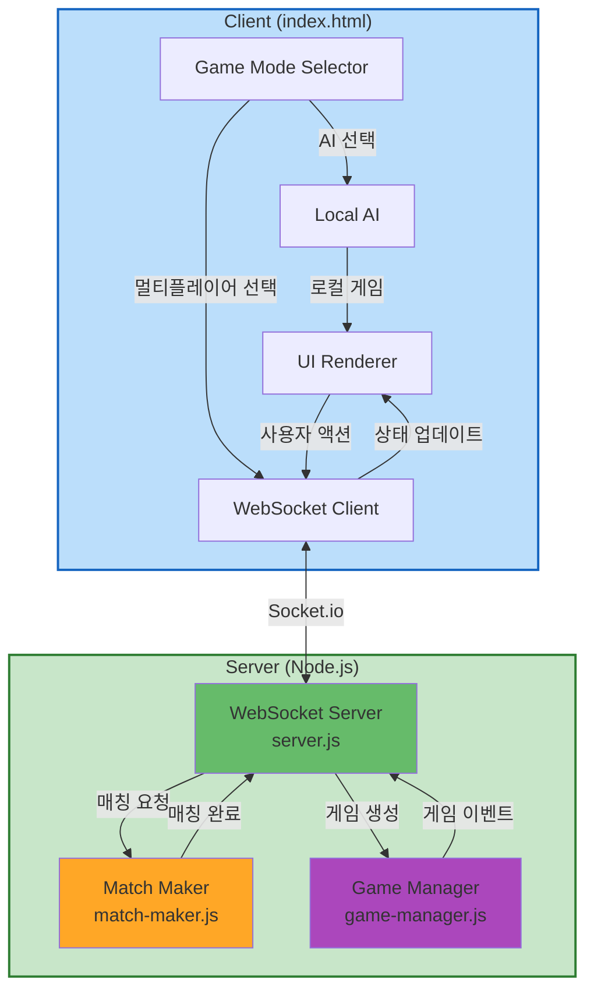

# Components Definition

## Overview
이 문서는 멀티플레이어 카드 배틀 게임의 주요 컴포넌트, 책임, 인터페이스를 정의합니다.

---

## Server-Side Components

### 1. WebSocket Server (server.js)
**Purpose**: Express + Socket.io 기반 WebSocket 서버, 클라이언트 연결 관리 및 이벤트 라우팅

**Responsibilities**:
- HTTP 서버 초기화 (Express)
- Socket.io 서버 초기화 및 설정
- 클라이언트 연결/해제 이벤트 처리
- WebSocket 이벤트 라우팅 (클라이언트 → 서버)
- 로컬 네트워크 IP 자동 감지 및 콘솔 출력
- 정적 파일 제공 (index.html)

**Interfaces**:
- **Input**: WebSocket 연결, 클라이언트 이벤트
- **Output**: 클라이언트로 이벤트 브로드캐스트
- **Dependencies**: MatchMaker, GameManager

**Key Data**:
- `io`: Socket.io 서버 인스턴스
- `connectedSockets`: Map<socketId, socketInstance>

---

### 2. Match Maker (match-maker.js)
**Purpose**: 플레이어 매칭 큐 관리 및 FIFO 방식 매칭

**Responsibilities**:
- 매칭 큐 관리 (플레이어 추가/제거)
- FIFO 방식으로 2명의 플레이어 매칭
- 매칭 완료 시 게임 세션 생성 요청
- 플레이어 연결 끊김 시 큐에서 제거

**Interfaces**:
- **Input**: 
  - `addPlayerToQueue(socketId)`: 플레이어를 큐에 추가
  - `removePlayerFromQueue(socketId)`: 플레이어를 큐에서 제거
- **Output**: 
  - 매칭된 플레이어 페어 반환
  - 매칭 이벤트 발생
- **Dependencies**: 없음 (독립적인 서비스)

**Key Data**:
- `waitingQueue`: Array<socketId> - FIFO 큐

**Algorithm**:
```
addPlayerToQueue(socketId):
  1. waitingQueue.push(socketId)
  2. if waitingQueue.length >= 2:
     - player1 = waitingQueue.shift()
     - player2 = waitingQueue.shift()
     - return { player1, player2 }
  3. return null
```

---

### 3. Game Manager (game-manager.js)
**Purpose**: 게임 세션 생성, 상태 관리, 게임 로직 실행

**Responsibilities**:
- 게임 세션 생성 및 초기화
- 게임 상태 저장 및 관리 (인메모리 Map)
- 카드 덱 생성 및 셔플
- 카드 제출 처리 및 검증
- 배틀 판정 (카드 비교, HP 계산)
- 턴 관리 (현재 플레이어, 턴 수)
- 턴 타이머 관리 (10초 제한)
- 게임 종료 조건 확인
- 이모티콘 전송 처리

**Interfaces**:
- **Input**:
  - `createGame(player1SocketId, player2SocketId)`: 게임 생성
  - `handleCardSubmit(gameId, playerId, cardIndex)`: 카드 제출 처리
  - `handleEmoji(gameId, playerId, emoji)`: 이모티콘 전송
  - `handleDisconnect(socketId)`: 플레이어 연결 끊김 처리
- **Output**:
  - 게임 상태 업데이트 이벤트
  - 배틀 결과 이벤트
  - 게임 종료 이벤트
- **Dependencies**: 없음 (게임 로직 자체 포함)

**Key Data**:
- `games`: Map<gameId, GameState>
- `socketToGame`: Map<socketId, gameId>

**Game State Structure**:
```javascript
{
  gameId: string,
  player1: {
    socketId: string,
    hand: Array<Card>,
    hp: number,
    submittedCard: Card | null
  },
  player2: {
    socketId: string,
    hand: Array<Card>,
    hp: number,
    submittedCard: Card | null
  },
  turn: number,
  currentPlayer: 1 | 2,
  turnTimer: Timeout | null,
  status: 'waiting' | 'playing' | 'ended'
}
```

---

## Client-Side Components

### 4. Game Mode Selector (index.html)
**Purpose**: 게임 시작 시 AI 대전 또는 멀티플레이어 선택

**Responsibilities**:
- 모드 선택 UI 표시
- AI 모드 선택 시 기존 로컬 게임 시작
- 멀티플레이어 선택 시 WebSocket 연결 및 매칭 큐 진입

**Interfaces**:
- **Input**: 사용자 클릭 이벤트
- **Output**: 모드 선택 결과 → WebSocketClient 또는 LocalAI

---

### 5. WebSocket Client (index.html - integrated)
**Purpose**: 서버와의 WebSocket 통신 관리

**Responsibilities**:
- Socket.io 클라이언트 초기화 및 연결
- 서버 연결/재연결 처리
- 서버 이벤트 수신 및 핸들링
- 클라이언트 이벤트 송신 (카드 제출, 이모티콘)
- 연결 상태 모니터링

**Interfaces**:
- **Input**: 
  - 사용자 액션 (카드 선택, 이모티콘 클릭)
  - 서버 이벤트 (match:found, game:start, turn:result 등)
- **Output**: 
  - 서버로 이벤트 전송
  - UIRenderer로 상태 업데이트 요청

**Server Events (Received)**:
- `match:found` - 매칭 완료
- `game:start` - 게임 시작 (초기 패 수신)
- `turn:waiting` - 상대방 턴 대기
- `turn:result` - 턴 결과 (카드, HP 업데이트)
- `game:end` - 게임 종료
- `timer:tick` - 타이머 업데이트 (남은 시간)
- `emoji:received` - 이모티콘 수신
- `opponent:disconnected` - 상대방 연결 끊김

**Client Events (Sent)**:
- `player:join` - 매칭 큐 진입
- `card:submit` - 카드 제출 `{ gameId, cardIndex }`
- `emoji:send` - 이모티콘 전송 `{ gameId, emoji }`

---

### 6. UI Renderer (index.html - existing + updates)
**Purpose**: 게임 화면 렌더링 및 사용자 인터랙션 처리

**Responsibilities**:
- 모드 선택 화면 렌더링
- 매칭 대기 화면 표시
- 게임 화면 렌더링 (카드 패, 배틀 영역, HP, 턴)
- 턴 타이머 표시 (카운트다운)
- 이모티콘 UI 표시
- 상대방 연결 상태 표시
- 게임 결과 오버레이 표시

**Interfaces**:
- **Input**: 
  - 게임 상태 업데이트 (WebSocketClient 또는 LocalAI)
  - 사용자 인터랙션 이벤트
- **Output**: 
  - DOM 업데이트
  - 사용자 액션 이벤트

**Key Functions** (기존 + 신규):
- `renderModeSelection()` - 모드 선택 화면 [신규]
- `renderMatchingScreen()` - 매칭 대기 화면 [신규]
- `renderPlayerHand()` - 플레이어 패 렌더링 [기존]
- `renderBattleCard()` - 배틀 카드 렌더링 [기존]
- `renderTimer(remainingTime)` - 타이머 표시 [신규]
- `renderEmoji(emoji)` - 이모티콘 표시 [신규]
- `updateGameState(state)` - 게임 상태 기반 UI 업데이트 [기존 수정]

---

### 7. Local AI (index.html - existing)
**Purpose**: AI 모드 시 로컬 AI 대전 상대

**Responsibilities**:
- AI 카드 선택 전략 실행
- 로컬 게임 로직 실행 (서버 없음)

**Interfaces**:
- **Input**: 플레이어 카드, AI 패
- **Output**: AI 선택 카드

**Note**: 기존 코드 유지 (변경 없음)

---

## Shared Components

### 8. Data Models
**Purpose**: 클라이언트와 서버 간 공유 데이터 구조

**Card Model**:
```javascript
{
  suit: string,      // '♠', '♥', '♦', '♣'
  rank: string,      // 'A', '2'-'10', 'J', 'Q', 'K'
  value: number      // 1-13
}
```

**Game State Model** (서버 사이드):
```javascript
{
  gameId: string,
  player1: { socketId, hand, hp, submittedCard },
  player2: { socketId, hand, hp, submittedCard },
  turn: number,
  currentPlayer: 1 | 2,
  turnTimer: Timeout | null,
  status: 'waiting' | 'playing' | 'ended'
}
```

**Client State Model** (클라이언트 사이드):
```javascript
{
  gameId: string,
  myHand: Array<Card>,
  myHp: number,
  opponentHp: number,
  turn: number,
  isMyTurn: boolean,
  remainingTime: number
}
```

---

### 9. Protocol Definition
**Purpose**: WebSocket 이벤트 스펙 정의

**Event Structure**:
```javascript
// Client → Server
{
  event: 'player:join' | 'card:submit' | 'emoji:send',
  data: { ... }
}

// Server → Client
{
  event: 'match:found' | 'game:start' | 'turn:result' | 'game:end' | ...,
  data: { ... }
}
```

자세한 이벤트 페이로드는 `component-methods.md` 참조.

---

## Component Diagram



---

## Component Count Summary

| Layer | Component Count |
|-------|-----------------|
| **Server-Side** | 3 (WebSocket Server, Match Maker, Game Manager) |
| **Client-Side** | 4 (Mode Selector, WebSocket Client, UI Renderer, Local AI) |
| **Shared** | 2 (Data Models, Protocol) |
| **Total** | 9 components |

---

## Notes

- **Server components**: 모듈화 (server.js, match-maker.js, game-manager.js)
- **Client components**: index.html 내부에 통합 (최소 변경)
- **Data storage**: 인메모리 Map (게임 세션, 소켓 매핑)
- **Communication**: Socket.io WebSocket (이벤트 기반)
