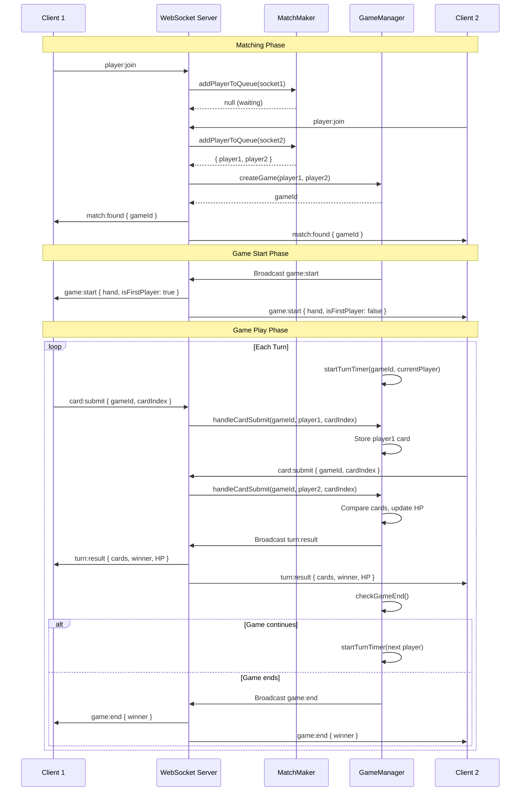
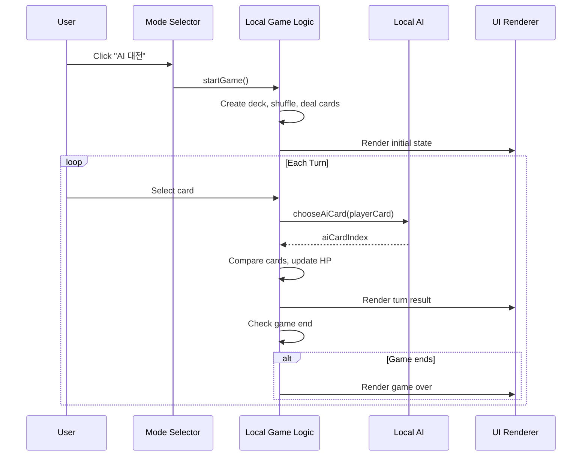
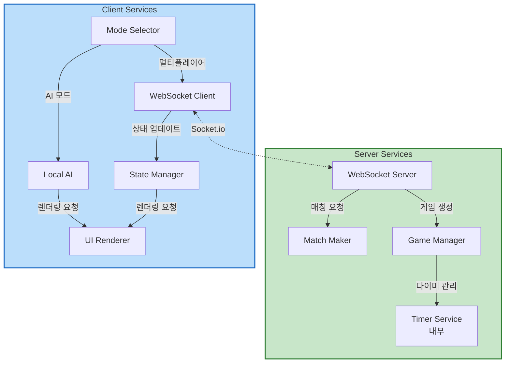

# Services

## Overview
이 문서는 서비스 레이어의 정의, 책임, 오케스트레이션 패턴을 정의합니다.

**Service Layer Purpose**: 비즈니스 로직을 캡슐화하고 컴포넌트 간 상호작용을 조정합니다.

---

## Server-Side Services

### 1. Matching Service (MatchMaker)
**Module**: `match-maker.js`

**Responsibilities**:
- 플레이어 매칭 큐 관리
- FIFO 방식 매칭 수행
- 매칭 대기 플레이어 추적
- 큐에서 플레이어 제거 (연결 끊김 시)

**Interface**:
```javascript
class MatchMaker {
  constructor()
  addPlayerToQueue(socketId: string): MatchResult | null
  removePlayerFromQueue(socketId: string): boolean
  getQueueLength(): number
}

type MatchResult = {
  player1: string,
  player2: string
}
```

**State**:
- `waitingQueue`: Array<socketId> - FIFO 큐

**Business Rules**:
- 큐에 2명 이상 있을 때 자동 매칭
- 선입선출 (First-In-First-Out) 보장
- 중복 추가 방지 (같은 플레이어가 큐에 여러 번 들어갈 수 없음)

**Orchestration Pattern**: 이벤트 기반
- WebSocket Server가 `player:join` 이벤트 수신
- MatchMaker.addPlayerToQueue() 호출
- 매칭 성공 시 GameManager.createGame() 호출

---

### 2. Game Session Service (GameManager)
**Module**: `game-manager.js`

**Responsibilities**:
- 게임 세션 생성 및 초기화
- 게임 상태 저장 및 관리
- 게임 로직 실행 (카드 비교, HP 계산)
- 턴 관리 및 타이머 설정
- 게임 종료 조건 확인
- 플레이어 액션 검증
- 이모티콘 전송 처리

**Interface**:
```javascript
class GameManager {
  constructor()
  
  // 게임 라이프사이클
  createGame(player1SocketId: string, player2SocketId: string, io: SocketIO): string
  endGame(gameId: string, io: SocketIO): void
  getGame(gameId: string): GameState | null
  
  // 게임 로직
  handleCardSubmit(gameId: string, playerId: string, cardIndex: number, io: SocketIO): void
  compareCards(card1: Card, card2: Card): 1 | 2 | 0
  checkGameEnd(gameId: string, io: SocketIO): boolean
  
  // 카드 관리
  createDeck(): Array<Card>
  shuffle(deck: Array<Card>): Array<Card>
  
  // 타이머 관리
  startTurnTimer(gameId: string, playerId: string, io: SocketIO): void
  clearTurnTimer(gameId: string): void
  handleTimeoutCardSubmit(gameId: string, playerId: string, io: SocketIO): void
  
  // 기타
  handleDisconnect(socketId: string, io: SocketIO): void
  handleEmoji(gameId: string, playerId: string, emoji: string, io: SocketIO): void
}
```

**State**:
- `games`: Map<gameId, GameState> - 모든 활성 게임
- `socketToGame`: Map<socketId, gameId> - 소켓 ID → 게임 ID 매핑

**Business Rules**:
- 각 게임은 정확히 2명의 플레이어
- 초기 HP: 10, 초기 카드: 10장
- 턴 시간 제한: 10초
- 카드 값 높은 쪽이 승리, 패자는 HP -1
- 게임 종료 조건: HP 0 또는 10턴 완료

**Orchestration Pattern**: 이벤트 기반 + 상태 머신
- 게임 상태: `waiting` → `playing` → `ended`
- 각 상태 전환 시 이벤트 브로드캐스트

---

### 3. Timer Service (GameManager 내부)
**Module**: `game-manager.js` (별도 모듈 아님, GameManager 메서드)

**Responsibilities**:
- 턴 타이머 시작 및 관리
- 타임아웃 감지 및 처리
- 타이머 취소 (카드 제출 시)
- 클라이언트에 남은 시간 브로드캐스트

**Interface**:
```javascript
startTurnTimer(gameId, playerId, io)
clearTurnTimer(gameId)
handleTimeoutCardSubmit(gameId, playerId, io)
```

**State**:
- `game.turnTimer`: Timeout | null - setTimeout 참조

**Business Rules**:
- 턴 시작 시 10초 타이머 자동 시작
- 카드 제출 시 타이머 자동 취소
- 타임아웃 시 랜덤 카드 자동 제출
- 매 초마다 `timer:tick` 이벤트 전송 (선택 사항)

**Orchestration Pattern**: 시간 기반 이벤트
- `startTurnTimer()` → setTimeout 설정
- 10초 경과 → `handleTimeoutCardSubmit()` 자동 호출
- `clearTurnTimer()` → setTimeout 취소

---

## Client-Side Services

### 4. WebSocket Communication Service
**Module**: `index.html` (내부 함수들)

**Responsibilities**:
- 서버 연결 관리
- 이벤트 송수신
- 재연결 처리 (Socket.io 자동)
- 연결 상태 모니터링

**Interface**:
```javascript
initializeWebSocket(serverUrl: string): void
registerEventListeners(): void
emitCardSubmit(cardIndex: number): void
emitEmoji(emoji: string): void
```

**State**:
- `socket`: Socket.io 클라이언트 인스턴스
- `gameId`: 현재 게임 ID
- `isConnected`: 연결 상태

**Business Rules**:
- 멀티플레이어 모드 선택 시에만 연결
- 연결 끊김 시 사용자에게 알림
- AI 모드에서는 서버 연결 안 함

**Orchestration Pattern**: 이벤트 기반
- 서버 이벤트 수신 → 해당 핸들러 호출
- 핸들러 → UIRenderer 호출 (화면 업데이트)

---

### 5. Game State Management Service
**Module**: `index.html` (전역 변수)

**Responsibilities**:
- 클라이언트 사이드 게임 상태 저장
- 서버 응답 기반 상태 업데이트
- AI 모드 vs 멀티플레이어 모드 상태 분리

**Interface**:
```javascript
// Global state variables
let gameMode = null; // 'ai' | 'multiplayer'
let gameId = null;
let myHand = [];
let myHp = 10;
let opponentHp = 10;
let turn = 1;
let isMyTurn = false;
let remainingTime = 10;
```

**State**:
- Multiplayer 모드: 서버로부터 상태 수신
- AI 모드: 로컬 상태 관리 (기존 방식 유지)

**Business Rules**:
- 멀티플레이어 모드: 서버 상태가 단일 진실 공급원
- AI 모드: 클라이언트 상태가 단일 진실 공급원
- 상대방 패는 절대 노출되지 않음 (멀티플레이어)

---

### 6. UI Rendering Service
**Module**: `index.html` (렌더링 함수들)

**Responsibilities**:
- 모든 UI 렌더링
- 사용자 인터랙션 처리
- 애니메이션 효과
- 에러 메시지 표시

**Interface**:
```javascript
renderModeSelection(): void
renderMatchingScreen(): void
renderPlayerHand(hand: Array<Card>): void
renderBattleCard(element: HTMLElement, card: Card): void
renderTimer(remainingTime: number): void
renderEmojiButton(): void
showEmojiAnimation(emoji: string): void
updateGameState(state: object): void
```

**State**: 없음 (순수 렌더링 함수)

**Business Rules**:
- 게임 모드에 따라 다른 UI 표시
- 자신의 턴일 때만 카드 선택 가능
- 타이머가 5초 이하일 때 빨간색 강조

---

## Service Orchestration

### Multiplayer Game Flow



---

### AI Mode Flow (Local)



---

## Service Dependencies



---

## Service Interaction Patterns

### 1. Event-Driven Pattern
**Usage**: WebSocket 통신, 게임 상태 변경

**Flow**:
1. 이벤트 발생 (사용자 액션, 서버 이벤트)
2. 이벤트 핸들러 실행
3. 서비스 메서드 호출
4. 상태 업데이트
5. 새로운 이벤트 발생 (브로드캐스트)

**Example**: 카드 제출
```
Client: card:submit 이벤트 전송
→ Server: handleCardSubmit() 호출
→ GameManager: 게임 로직 실행
→ Server: turn:result 이벤트 브로드캐스트
→ Client: turn:result 핸들러 실행
→ UIRenderer: 화면 업데이트
```

---

### 2. Request-Response Pattern
**Usage**: 매칭 요청

**Flow**:
1. 클라이언트 요청
2. 서버 처리
3. 서버 응답

**Example**: 매칭
```
Client: player:join 이벤트
→ Server: MatchMaker.addPlayerToQueue()
→ MatchMaker: 매칭 시도
→ Server: match:found 이벤트 (매칭 성공 시)
```

---

### 3. Timer-Based Pattern
**Usage**: 턴 타이머

**Flow**:
1. 타이머 시작 (setTimeout)
2. 주기적으로 상태 확인
3. 타임아웃 시 자동 액션

**Example**: 턴 타이머
```
GameManager: startTurnTimer()
→ setTimeout(10초)
→ 매 초마다 timer:tick 이벤트
→ 10초 경과 시: handleTimeoutCardSubmit()
→ 랜덤 카드 자동 제출
```

---

## Service Configuration

### Server Configuration
```javascript
const PORT = 3000;
const TURN_TIMEOUT = 10000; // 10초 (밀리초)
const MAX_PLAYERS_PER_GAME = 2;
const INITIAL_HP = 10;
const INITIAL_CARDS = 10;
const MAX_TURNS = 10;
```

### Client Configuration
```javascript
const SERVER_URL = 'http://localhost:3000'; // 개발 환경
// const SERVER_URL = 'http://192.168.1.100:3000'; // 로컬 네트워크
const RECONNECT_ATTEMPTS = 3;
const EMOJI_DISPLAY_DURATION = 3000; // 3초
```

---

## Error Handling Strategy

### Server-Side
**Strategy**: 기본 에러 처리 (console.error + 클라이언트 알림)

**Error Categories**:
1. **Validation Errors**: 잘못된 카드 인덱스, 유효하지 않은 턴
   - Action: 에러 이벤트 전송, 클라이언트에 알림
2. **Network Errors**: 연결 끊김, 타임아웃
   - Action: 게임 종료, 상대방에게 알림
3. **Internal Errors**: 예상치 못한 에러
   - Action: console.error, 게임 종료

**Example**:
```javascript
try {
  // 게임 로직
} catch (error) {
  console.error('Game error:', error);
  socket.emit('error', { message: '게임 오류가 발생했습니다' });
}
```

---

### Client-Side
**Strategy**: 기본 에러 처리 (alert + 페이지 새로고침 권장)

**Error Categories**:
1. **Connection Errors**: 서버 연결 실패
   - Action: alert("서버에 연결할 수 없습니다")
2. **Game Errors**: 서버에서 에러 이벤트 수신
   - Action: 에러 메시지 표시, 게임 종료
3. **Timeout Errors**: 네트워크 지연
   - Action: "응답 대기 중..." 메시지

**Example**:
```javascript
socket.on('connect_error', (error) => {
  console.error('Connection error:', error);
  alert('서버에 연결할 수 없습니다. 네트워크를 확인하세요.');
});
```

---

## Service Summary

| Service | Module | Responsibility | Pattern |
|---------|--------|----------------|---------|
| **Matching Service** | match-maker.js | 플레이어 매칭 | Event-Driven |
| **Game Session Service** | game-manager.js | 게임 로직 및 상태 관리 | Event-Driven + State Machine |
| **Timer Service** | game-manager.js | 턴 타이머 관리 | Timer-Based |
| **WebSocket Communication** | index.html | 서버 통신 | Event-Driven |
| **Game State Management** | index.html | 클라이언트 상태 | State Management |
| **UI Rendering** | index.html | 화면 렌더링 | Reactive |

**Total Services**: 6 (서버 3개, 클라이언트 3개)

---

## Notes

- 서비스는 단일 책임 원칙(SRP) 준수
- 이벤트 기반 아키텍처로 느슨한 결합 유지
- 프로토타입이므로 복잡한 패턴 (DI, Repository 등) 불필요
- 향후 확장 시 서비스 분리 가능 (예: Timer Service를 독립 모듈로)
