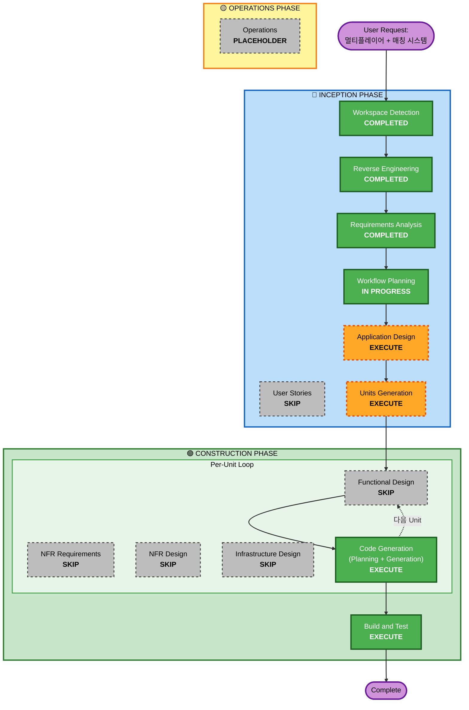
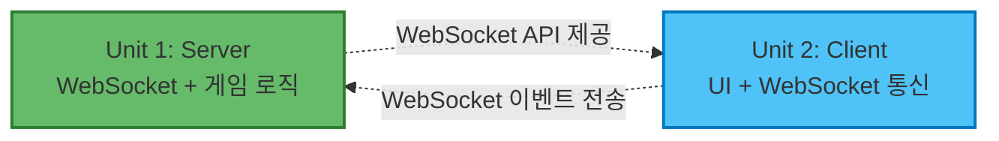

# Execution Plan

## Detailed Analysis Summary

### Transformation Scope
- **Transformation Type**: Architectural Transformation
- **Primary Changes**: 
  - 클라이언트 전용 → 클라이언트-서버 분리 아키텍처
  - 로컬 게임 로직 → 서버 사이드 게임 로직 + 클라이언트 동기화
  - HTTP 정적 서빙 → WebSocket 실시간 통신
- **Related Components**: 
  - 기존: index.html (클라이언트 전용)
  - 신규: server/ (WebSocket 서버, 게임 관리자, 매칭 시스템)

### Change Impact Assessment

#### User-facing Changes: Yes
- 게임 시작 시 모드 선택 UI 추가 (AI 대전 / 멀티플레이어)
- 매칭 대기 화면 추가
- 턴 시간 제한 타이머 표시 (10초 카운트다운)
- 이모티콘 전송 UI 추가
- 상대방 연결 상태 표시

#### Structural Changes: Yes - Major
- **Before**: 단일 파일 클라이언트 애플리케이션
- **After**: 클라이언트-서버 분리 아키텍처
- 새로운 서버 컴포넌트 추가:
  - WebSocket 서버 (Express + Socket.io)
  - 매칭 시스템 (FIFO 큐)
  - 게임 관리자 (게임 세션 상태 관리)
  - 게임 로직 (서버 사이드 검증)

#### Data Model Changes: Yes - Minor
- 게임 상태 구조 변경:
  - **Before**: 클라이언트 전역 변수 (playerHand, aiHand, playerHp, aiHp)
  - **After**: 서버 관리 게임 세션 객체
- 새로운 데이터 구조:
  - 매칭 큐 (대기 중인 플레이어 목록)
  - 게임 세션 맵 (gameId → 게임 상태)
  - 플레이어 소켓 매핑 (socketId → playerId)

#### API Changes: Yes - New APIs
- **New**: WebSocket 이벤트 기반 API
  - Client → Server: `player:join`, `card:submit`, `emoji:send`
  - Server → Client: `match:found`, `game:start`, `turn:result`, `game:end`, `timer:tick`, `emoji:received`
- **Preserved**: 기존 AI 모드 로컬 API 유지

#### NFR Impact: Yes
- **Performance**: 네트워크 지연 추가 (로컬 네트워크 기준 허용 가능)
- **Security**: 서버 사이드 검증 추가 (카드 제출, 턴 순서, HP 계산)
- **Scalability**: 소규모 (10명 미만) 설계, 향후 확장 불고려
- **Reliability**: 연결 끊김 감지 및 처리

### Risk Assessment
- **Risk Level**: Medium
- **Rollback Complexity**: Easy (기존 index.html 백업 보존)
- **Testing Complexity**: Moderate (로컬 네트워크 환경 필요, 2개 클라이언트 동시 테스트)

**Risk Factors**:
- ⚠️ 네트워크 통신 추가 (새로운 실패 지점)
- ⚠️ 서버 사이드 로직 구현 (동시성 처리)
- ⚠️ 실시간 동기화 (타이밍 이슈)
- ✅ 기존 코드 품질 양호 (리버스 엔지니어링에서 B+ 평가)
- ✅ 명확한 요구사항 (프로토타입 수준)

---

## Workflow Visualization

---

## Phases to Execute

### 🔵 INCEPTION PHASE

#### ✅ Workspace Detection - COMPLETED
- **Status**: 완료 (2026-05-13T12:47:00Z)
- **Result**: Brownfield 프로젝트 감지

#### ✅ Reverse Engineering - COMPLETED
- **Status**: 완료 (2026-05-13T12:47:30Z)
- **Result**: 9개 분석 산출물 생성

#### ✅ Requirements Analysis - COMPLETED
- **Status**: 완료 (2026-05-13T12:53:00Z)
- **Result**: 8 FR + 5 NFR + 4 TR 정의

#### ❌ User Stories - SKIP
- **Rationale**: 
  - 프로토타입 프로젝트 (빠른 구현 우선)
  - 사용자 페르소나 불필요 (개발자 본인 사용)
  - 명확한 기능 요구사항 이미 정의됨
  - User Stories 단계는 복잡한 비즈니스 요구사항이나 다중 사용자 시나리오에 적합
  - 현재 프로젝트는 기술 중심의 간단한 게임

#### ⏳ Workflow Planning - IN PROGRESS
- **Status**: 현재 단계

#### ✅ Application Design - EXECUTE
- **Rationale**:
  - **새로운 컴포넌트 필요**: 서버 아키텍처 (Express + Socket.io, 매칭 시스템, 게임 관리자)
  - **컴포넌트 간 상호작용 정의 필요**: 클라이언트-서버 통신, WebSocket 이벤트 플로우
  - **서비스 레이어 설계 필요**: 매칭 서비스, 게임 세션 관리 서비스
  - **상태 관리 변경**: 클라이언트 전역 변수 → 서버 사이드 게임 세션
- **Artifacts to Generate**:
  - 고수준 아키텍처 다이어그램 (클라이언트-서버 분리)
  - 컴포넌트 식별 (서버 모듈 구조)
  - 컴포넌트 간 상호작용 (WebSocket 이벤트 플로우)

#### ✅ Units Generation - EXECUTE
- **Rationale**:
  - **다중 구현 단위 필요**: 서버 개발과 클라이언트 수정을 분리된 유닛으로 관리
  - **병렬 개발 가능성**: 서버와 클라이언트를 독립적으로 구현 가능
  - **명확한 책임 분리**: 
    - Unit 1: 서버 구현 (WebSocket 서버, 매칭 시스템, 게임 관리자)
    - Unit 2: 클라이언트 수정 (WebSocket 통신, UI 업데이트)
- **Expected Output**:
  - 2개 유닛 생성 (서버, 클라이언트)
  - 각 유닛의 범위 및 책임 정의
  - 유닛 간 인터페이스 정의 (WebSocket 이벤트)

---

### 🟢 CONSTRUCTION PHASE

#### ❌ Functional Design (per-unit) - SKIP
- **Rationale**:
  - 게임 로직이 이미 명확함 (기존 코드 재사용)
  - 새로운 비즈니스 로직 없음 (기존 규칙 유지)
  - 데이터 모델 단순함 (게임 세션 객체)
  - 프로토타입 수준 (상세 설계 불필요)

#### ❌ NFR Requirements (per-unit) - SKIP
- **Rationale**:
  - NFR이 이미 요구사항 문서에 명확히 정의됨
  - 기술 스택 이미 선정 (Node.js + Socket.io)
  - 성능/보안 요구사항 명확 (최소 수준)
  - 추가 NFR 평가 불필요

#### ❌ NFR Design (per-unit) - SKIP
- **Rationale**:
  - NFR Requirements 단계를 스킵했으므로 이 단계도 스킵
  - 기본 Socket.io 패턴으로 충분
  - 복잡한 NFR 패턴 불필요 (캐싱, 로드 밸런싱 등)

#### ❌ Infrastructure Design (per-unit) - SKIP
- **Rationale**:
  - 인프라가 매우 단순함 (로컬 Node.js 서버)
  - 배포 환경 명확 (로컬 네트워크)
  - 클라우드 리소스 없음
  - 인프라 코드 불필요 (CDK, Terraform 등)

#### ✅ Code Generation (per-unit) - EXECUTE (ALWAYS)
- **Rationale**: 
  - 항상 실행되는 단계
  - Part 1: 코드 생성 계획 수립 (체크리스트)
  - Part 2: 계획 실행 및 코드 생성
- **Expected Output**:
  - Unit 1 (서버): server.js, game-manager.js, match-maker.js, package.json
  - Unit 2 (클라이언트): index.html 수정 (WebSocket 통신 추가)

#### ✅ Build and Test - EXECUTE (ALWAYS)
- **Rationale**: 
  - 항상 실행되는 단계
  - 빌드 및 테스트 지침 생성
- **Expected Output**:
  - 빌드 지침 (npm install, 서버 시작)
  - 통합 테스트 지침 (2개 클라이언트로 매칭 테스트)
  - 수동 테스트 체크리스트

---

### 🟡 OPERATIONS PHASE

#### ❌ Operations - PLACEHOLDER
- **Rationale**: 향후 확장을 위한 플레이스홀더
- **Note**: 배포 및 모니터링 워크플로우는 현재 범위에서 제외

---

## Unit Breakdown

### Unit 1: Server Implementation
**Scope**: WebSocket 서버 및 게임 로직 구현

**Components**:
- `server/server.js` - Express + Socket.io 메인 서버
- `server/game-manager.js` - 게임 세션 관리 (상태, 로직, 검증)
- `server/match-maker.js` - 매칭 큐 시스템 (FIFO)
- `server/package.json` - 의존성 관리

**Responsibilities**:
- WebSocket 연결 관리
- 플레이어 매칭 (FIFO 큐)
- 게임 세션 생성 및 관리
- 게임 로직 실행 및 검증 (카드 비교, HP 계산, 턴 관리)
- 턴 타이머 관리 (10초 제한)
- 클라이언트 동기화 (이벤트 브로드캐스트)
- 연결 끊김 처리

**Key Functions**:
- `createGame(player1, player2)` - 게임 세션 생성
- `handleCardSubmit(gameId, playerId, cardIndex)` - 카드 제출 처리
- `validateTurn(gameId, playerId)` - 턴 검증
- `calculateBattleResult(card1, card2)` - 배틀 판정
- `addPlayerToQueue(socketId)` - 매칭 큐 추가
- `matchPlayers()` - 플레이어 매칭

**Dependencies**: express, socket.io

---

### Unit 2: Client Modification
**Scope**: 기존 클라이언트에 멀티플레이어 기능 추가

**Components**:
- `index.html` - 기존 파일 수정

**Modifications**:
- 게임 시작 화면 UI 추가 (AI 대전 / 멀티플레이어 선택)
- WebSocket 연결 로직 추가 (Socket.io-client)
- WebSocket 이벤트 핸들러 추가
  - `match:found`, `game:start`, `turn:result`, `game:end`
  - `timer:tick`, `emoji:received`, `opponent:disconnected`
- 매칭 대기 화면 추가
- 턴 타이머 UI 추가 (카운트다운 표시)
- 이모티콘 전송 UI 추가 (5개 버튼)
- 상대방 연결 상태 표시
- 게임 로직 수정 (서버 응답 기반으로 UI 업데이트)

**Responsibilities**:
- 서버 연결 관리
- 모드 선택 UI
- WebSocket 이벤트 송수신
- 서버로부터 받은 게임 상태로 UI 업데이트
- 로컬 AI 모드 유지 (기존 코드 보존)

**Dependencies**: Socket.io-client (CDN)

---

## Unit Dependencies

**Development Sequence**:
1. **병렬 개발 가능**: 서버와 클라이언트를 동시에 개발 가능
2. **통합 테스트**: 서버와 클라이언트 모두 완료 후 통합 테스트
3. **WebSocket 프로토콜**: 사전 정의된 이벤트 스펙 기반 (requirements.md TR-3)

---

## Estimated Timeline

### Phase Breakdown

| Phase | Stage | Duration |
|-------|-------|----------|
| **INCEPTION** | Application Design | 30분 |
| **INCEPTION** | Units Generation | 15분 |
| **CONSTRUCTION** | Code Generation - Unit 1 (Server) | 2~3시간 |
| **CONSTRUCTION** | Code Generation - Unit 2 (Client) | 2~3시간 |
| **CONSTRUCTION** | Build and Test | 1~2시간 |
| **Total** | | **6~10시간** |

**Note**: 병렬 개발 시 시간 단축 가능 (Unit 1과 Unit 2 동시 진행)

---

## Success Criteria

### Primary Goal
멀티플레이어 1:1 대전 가능한 프로토타입 구현

### Key Deliverables
1. ✅ WebSocket 서버 (로컬 네트워크 실행)
2. ✅ FIFO 매칭 시스템
3. ✅ 실시간 게임 동기화
4. ✅ 10초 턴 시간 제한
5. ✅ AI 모드 유지 (선택 가능)
6. ✅ 간단한 이모티콘 전송
7. ✅ 연결 끊김 처리
8. ✅ 로컬 IP 자동 감지 및 표시

### Quality Gates
- [ ] 서버 시작 시 로컬 IP 주소 콘솔 출력
- [ ] 2개 클라이언트가 같은 Wi-Fi에서 접속 가능
- [ ] 매칭 큐에서 자동 매칭 (FIFO)
- [ ] 게임 규칙 정확히 적용 (10장, 10HP, 10턴)
- [ ] 카드 제출 후 양쪽 클라이언트에 결과 표시
- [ ] 10초 초과 시 랜덤 카드 자동 제출
- [ ] 플레이어 연결 끊김 시 게임 종료
- [ ] 이모티콘 전송 및 수신 작동
- [ ] AI 모드 정상 작동 (기존 기능 유지)

---

## Risks and Mitigations

| Risk | Probability | Impact | Mitigation |
|------|-------------|--------|------------|
| WebSocket 연결 실패 | Medium | High | 에러 핸들링 추가, 재연결 로직 (Socket.io 자동 지원) |
| 동시성 버그 (게임 상태) | Medium | High | 서버 사이드 게임 상태 검증, 턴 순서 체크 |
| 타이머 정확도 이슈 | Low | Medium | 서버 사이드 타이머 사용 (setTimeout) |
| 방화벽 차단 | Medium | High | 로컬 네트워크 포트 오픈 가이드 제공 |
| 브라우저 호환성 | Low | Low | 모던 브라우저만 지원 명시 |

---

## Next Steps

1. ✅ Workflow Planning 승인 대기
2. ⏭️ Application Design 단계 진행
3. ⏭️ Units Generation 단계 진행
4. ⏭️ Code Generation - Unit 1 (Server)
5. ⏭️ Code Generation - Unit 2 (Client)
6. ⏭️ Build and Test

---

## Approval Status

**Date**: 2026-05-13
**Status**: Pending User Approval
