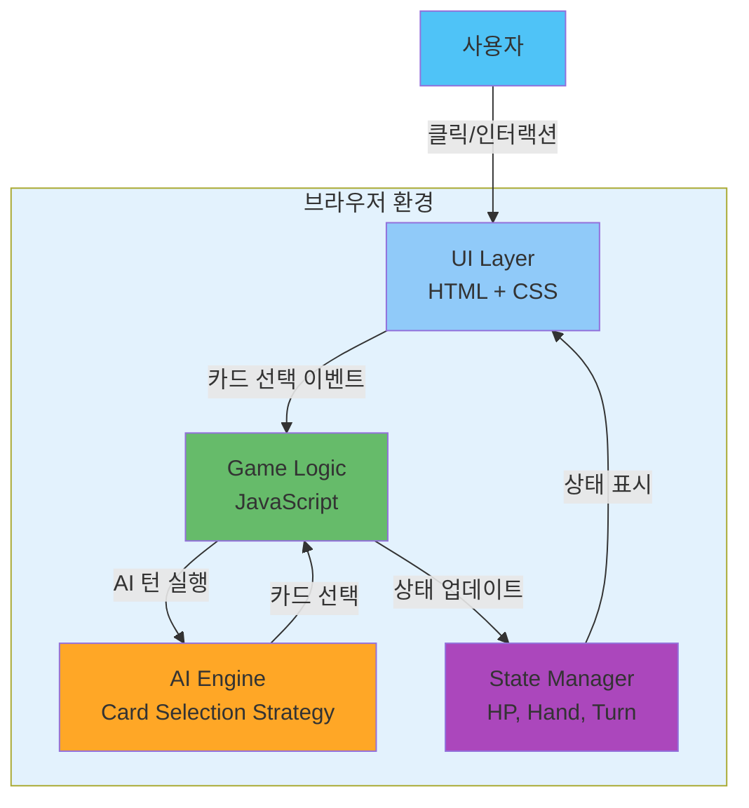
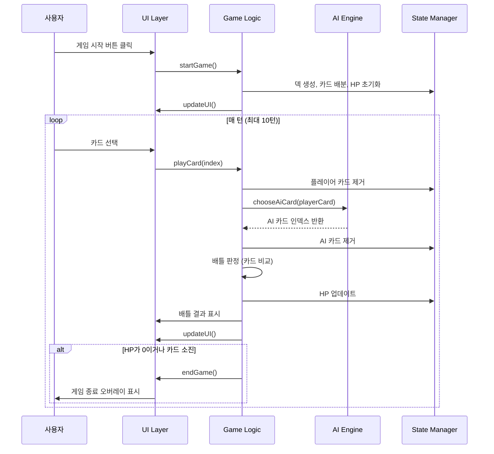

# System Architecture

## System Overview
현재 시스템은 클라이언트 사이드 전용 단일 플레이어 카드 배틀 게임입니다. 모든 로직과 UI가 단일 HTML 파일 내의 JavaScript로 구현되어 있으며, 서버 컴포넌트는 존재하지 않습니다. 게임 상태는 브라우저 메모리에서만 관리되며, AI 대전 상대는 클라이언트 사이드 로직으로 구현되어 있습니다.

## Architecture Diagram

## Component Descriptions

### UI Layer (HTML + CSS)
- **Purpose**: 게임 화면 표시 및 사용자 인터랙션 처리
- **Responsibilities**: 
  - 상태 바 표시 (플레이어/AI HP, 턴 수)
  - 배틀 영역 표시 (제출된 카드)
  - 플레이어 패 표시 및 카드 선택 UI
  - 게임 결과 오버레이 표시
  - AI 남은 카드 시각화
- **Dependencies**: GameLogic (이벤트 핸들러 연결)
- **Type**: Presentation Layer

### Game Logic (JavaScript)
- **Purpose**: 게임 규칙 적용 및 게임 플로우 제어
- **Responsibilities**:
  - 덱 생성 및 셔플
  - 카드 배분
  - 배틀 판정 (카드 비교 및 HP 계산)
  - 게임 종료 조건 체크
  - 턴 진행 제어
- **Dependencies**: State Manager, AI Engine, UI Layer
- **Type**: Business Logic Layer

### AI Engine (JavaScript)
- **Purpose**: AI 플레이어의 카드 선택 전략 구현
- **Responsibilities**:
  - 현재 상황에 맞는 최적 카드 선택
  - 전략: 이길 수 있는 가장 낮은 카드, 없으면 가장 낮은 카드 버림
- **Dependencies**: State Manager (AI 패 정보)
- **Type**: Business Logic Layer

### State Manager (JavaScript Variables)
- **Purpose**: 게임 상태 관리
- **Responsibilities**:
  - 플레이어/AI HP 추적
  - 플레이어/AI 패 관리
  - 턴 수 추적
  - 게임 진행 상태 플래그 관리
- **Dependencies**: None
- **Type**: Data Layer

## Data Flow

## Integration Points

### External APIs
- 없음 (완전히 클라이언트 사이드 애플리케이션)

### Databases
- 없음 (브라우저 메모리에서만 상태 관리)

### Third-party Services
- 없음

## Infrastructure Components

### CDK Stacks
- 없음

### Deployment Model
- 정적 파일 호스팅 (HTTP 서버로 제공)
- 현재: Python HTTP 서버 (포트 8080)
- 프로덕션 가능: 모든 정적 파일 호스팅 서비스 (S3, Netlify, Vercel 등)

### Networking
- 로컬 HTTP 서버 또는 CDN을 통한 정적 파일 제공
- 클라이언트 사이드 전용 - 네트워크 통신 없음
