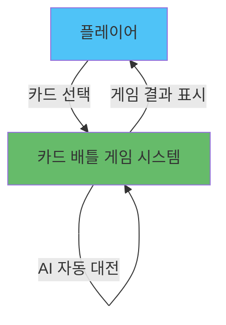

# Business Overview

## Business Context Diagram

## Business Description

### 전체 비즈니스 설명
카드 배틀 게임은 플레이어가 AI와 1:1로 카드 게임을 진행하는 단일 플레이어 게임입니다. 플레이어와 AI는 각각 10장의 카드를 받고, 매 턴마다 카드를 1장씩 제출하여 숫자를 비교합니다. 높은 숫자를 낸 쪽이 승리하며, 진 쪽은 HP를 1 잃습니다. 10턴 이내에 상대방의 HP를 0으로 만들면 승리합니다.

### Business Transactions
1. **게임 시작 (Game Start)**
   - 52장의 카드 덱을 생성하고 섞음
   - 플레이어와 AI에게 각각 10장씩 배분
   - 초기 HP 설정 (각각 10)

2. **카드 제출 (Card Submission)**
   - 플레이어가 패에서 카드 1장 선택
   - AI가 전략에 따라 카드 1장 선택
   - 선택된 카드를 배틀 영역에 표시

3. **배틀 판정 (Battle Resolution)**
   - 두 카드의 숫자 비교
   - 승자 결정 (높은 숫자가 승리)
   - 패자의 HP 1 감소
   - 무승부 시 HP 변화 없음

4. **게임 종료 (Game End)**
   - HP가 0이 되거나 10턴 완료 시 게임 종료
   - 최종 승패 판정
   - 게임 재시작 옵션 제공

### Business Dictionary
- **HP (Hit Points)**: 플레이어의 생명력, 0이 되면 패배
- **패 (Hand)**: 플레이어가 보유한 카드들
- **배틀 영역 (Battle Area)**: 제출된 카드가 비교되는 공간
- **턴 (Turn)**: 게임의 한 라운드 (최대 10턴)
- **AI 전략**: 이길 수 있는 가장 낮은 카드 사용, 없으면 가장 낮은 카드 버리기
- **카드 값 (Card Value)**: A=1, 2-10=숫자, J=11, Q=12, K=13

## Component Level Business Descriptions

### 게임 클라이언트 (index.html)
- **Purpose**: 단일 플레이어 카드 배틀 게임 UI 및 로직 제공
- **Responsibilities**: 
  - 게임 상태 관리 (플레이어/AI HP, 턴 수, 카드 패)
  - 사용자 인터랙션 처리 (카드 선택)
  - AI 로직 실행 (카드 선택 전략)
  - 게임 UI 렌더링 (상태 표시, 카드 표시, 결과 표시)
  - 게임 규칙 적용 및 승패 판정
