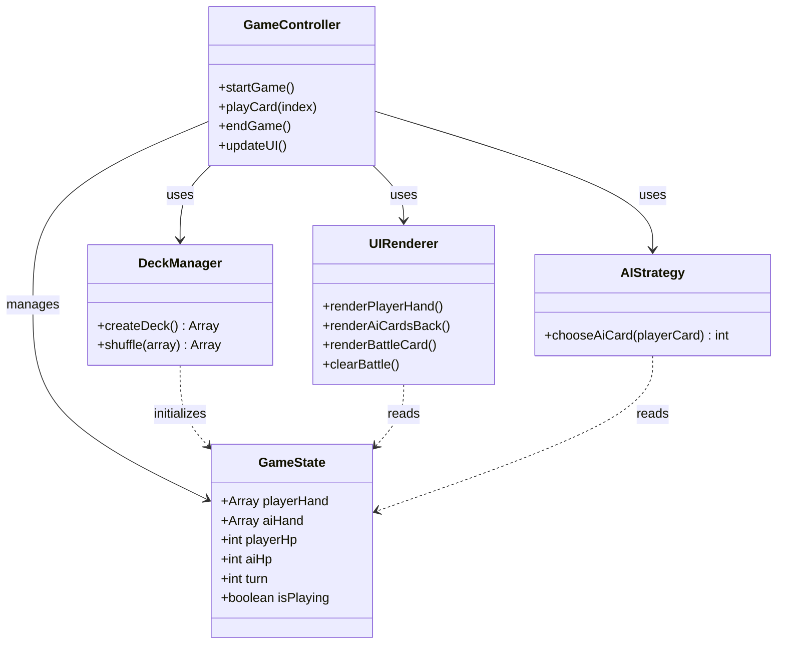

# Code Structure

## Build System
- **Type**: 없음 (정적 HTML/JavaScript)
- **Configuration**: 빌드 프로세스 없음 - 브라우저에서 직접 실행

## Project Structure

```
table-order/
├── index.html          (메인 게임 파일 - UI + 로직 통합)
├── CLAUDE.md           (AI-DLC 워크플로우 설정)
├── 제안사항.md         (프로젝트 제안 문서)
└── aidlc-docs/         (AI-DLC 문서)
```

## Key Modules/Components



## Existing Files Inventory

### `/index.html` - 메인 게임 파일 (통합형)
**Purpose**: 전체 게임 애플리케이션 (UI + 로직)

**Embedded Components**:
1. **HTML Structure (lines 1-299)**
   - 게임 컨테이너
   - 상태 바 (HP, 턴 정보)
   - AI 카드 뒷면 표시 영역
   - 배틀 영역
   - 플레이어 패 영역
   - 게임 종료 오버레이

2. **CSS Styles (lines 7-262)**
   - 게임 레이아웃 스타일
   - 카드 디자인 (앞면/뒷면)
   - 애니메이션 및 호버 효과
   - 반응형 디자인

3. **JavaScript Logic (lines 301-485)**
   - **Constants** (lines 302-305):
     - `SUITS`: 카드 무늬 배열
     - `SUIT_COLORS`: 무늬별 색상 매핑
     - `RANKS`: 카드 등급 배열
     - `RANK_VALUES`: 등급별 숫자 값 매핑

   - **State Variables** (lines 307-312):
     - `playerHand`: 플레이어 카드 패
     - `aiHand`: AI 카드 패
     - `playerHp`: 플레이어 HP
     - `aiHp`: AI HP
     - `turn`: 현재 턴
     - `isPlaying`: 게임 진행 상태

   - **Core Functions**:
     - `createDeck()` (lines 314-322): 52장 덱 생성
     - `shuffle(array)` (lines 324-330): Fisher-Yates 셔플 알고리즘
     - `startGame()` (lines 332-346): 게임 초기화 및 시작
     - `updateUI()` (lines 348-356): UI 업데이트
     - `renderPlayerHand()` (lines 358-375): 플레이어 패 렌더링
     - `renderAiCardsBack()` (lines 377-385): AI 카드 뒷면 렌더링
     - `clearBattle()` (lines 387-394): 배틀 영역 초기화
     - `renderBattleCard()` (lines 396-404): 배틀 카드 렌더링
     - `playCard(index)` (lines 406-440): 메인 게임 로직 (카드 제출 및 판정)
     - `chooseAiCard(playerCard)` (lines 442-457): AI 카드 선택 전략
     - `endGame()` (lines 459-481): 게임 종료 및 결과 표시

   - **Initialization** (line 483):
     - `startGame()` 자동 실행

## Design Patterns

### Module Pattern (Implicit)
- **Location**: 전체 JavaScript 코드
- **Purpose**: 글로벌 스코프 오염 방지 (함수 레벨 스코프 사용)
- **Implementation**: 함수와 변수를 스크립트 레벨에서 정의

### State Pattern (Implicit)
- **Location**: `isPlaying` 플래그 및 게임 상태 변수들
- **Purpose**: 게임 진행 상태에 따른 동작 제어
- **Implementation**: 
  - `isPlaying = true`: 플레이어 입력 허용
  - `isPlaying = false`: 플레이어 입력 비활성화 (AI 턴 진행 중)

### Strategy Pattern
- **Location**: `chooseAiCard()` 함수
- **Purpose**: AI의 카드 선택 알고리즘 캡슐화
- **Implementation**: 
  - 현재 전략: "이길 수 있는 가장 낮은 카드" 우선
  - 대체 전략: "가장 낮은 카드 버리기"

### Observer Pattern (DOM Events)
- **Location**: 카드 클릭 이벤트 리스너
- **Purpose**: 사용자 인터랙션 감지 및 게임 로직 트리거
- **Implementation**: `cardEl.addEventListener('click', () => playCard(index))`

## Code Organization Analysis

### Strengths
- ✅ 단순하고 이해하기 쉬운 구조
- ✅ 명확한 함수 분리 (렌더링, 로직, AI)
- ✅ 일관된 네이밍 컨벤션

### Areas for Improvement (멀티플레이어 전환 시)
- ⚠️ 클라이언트/서버 분리 필요
- ⚠️ 게임 상태 동기화 메커니즘 필요
- ⚠️ 네트워크 통신 레이어 추가 필요
- ⚠️ 매칭 시스템 구현 필요
- ⚠️ 보안: 클라이언트 사이드 검증만 존재 (서버 사이드 검증 필요)

## Critical Dependencies

### No External Dependencies
- 현재 프로젝트는 순수 HTML/CSS/JavaScript로 구현
- 외부 라이브러리 없음
- 브라우저 내장 API만 사용

### Browser APIs Used
- **DOM API**: 문서 조작 및 이벤트 처리
- **setTimeout**: 게임 타이밍 제어 (턴 간 딜레이)
- **Math.random()**: 카드 셔플

## Future Dependencies (멀티플레이어 구현 시)
아래는 멀티플레이어 전환 시 필요한 기술 스택:

### Server-side
- **Node.js**: 서버 런타임
- **Express.js** 또는 **Fastify**: HTTP 서버 프레임워크
- **Socket.io** 또는 **ws**: WebSocket 라이브러리

### Client-side
- **Socket.io-client**: WebSocket 클라이언트
