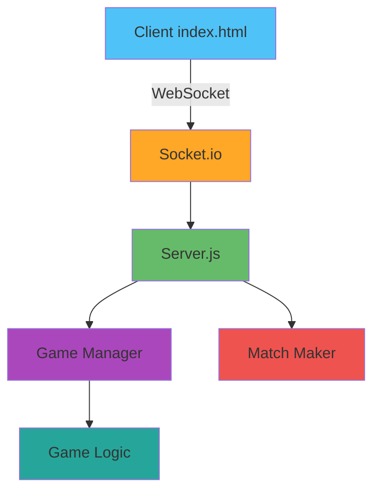

# Component Inventory

## Application Packages
- **index.html** - 단일 플레이어 카드 배틀 게임 (UI + 로직 통합)

## Infrastructure Packages
- 없음 (현재 인프라 없음)

## Shared Packages
- 없음 (외부 라이브러리 없음)

## Test Packages
- 없음 (테스트 코드 없음)

## Documentation
- **CLAUDE.md** - AI-DLC 워크플로우 설정 파일
- **제안사항.md** - 프로젝트 개선 제안 문서
- **aidlc-docs/** - AI-DLC 생성 문서 디렉토리

## Total Count
- **Total Components**: 1
- **Application**: 1
- **Infrastructure**: 0
- **Shared**: 0
- **Test**: 0
- **Documentation**: 2 (+ aidlc-docs/)

## Component Breakdown

### Application Layer
| Component | Type | Language | Lines | Purpose |
|-----------|------|----------|-------|---------|
| index.html | Web Application | HTML/CSS/JS | ~485 | 단일 플레이어 카드 배틀 게임 |

### Infrastructure Layer
현재 인프라 없음. 멀티플레이어 구현 시 필요:
- WebSocket 서버 (Node.js + Socket.io)
- 게임 상태 관리 서비스
- 매칭 시스템
- (Optional) 데이터베이스 (사용자 통계, 게임 기록)

## File Structure

```
table-order/
├── index.html                      # 메인 게임 파일
├── CLAUDE.md                       # AI-DLC 워크플로우 설정
├── 제안사항.md                     # 프로젝트 제안
├── .git/                           # Git 저장소
├── .aidlc-rule-details/            # AI-DLC 규칙 파일
└── aidlc-docs/                     # AI-DLC 생성 문서
    ├── audit.md                    # 워크플로우 감사 로그
    ├── aidlc-state.md              # 워크플로우 상태 추적
    └── inception/
        └── reverse-engineering/    # 리버스 엔지니어링 산출물
```

## Complexity Analysis

### Current System
- **총 코드 라인**: ~485 (HTML 포함)
- **JavaScript 라인**: ~183
- **복잡도**: 낮음 (단순한 게임 로직)
- **유지보수성**: 높음 (명확한 함수 분리)

### Future System (멀티플레이어)
예상 구조:
```
client/
├── index.html              # 게임 UI
├── js/
│   ├── game-client.js      # 게임 클라이언트 로직
│   ├── socket-handler.js   # WebSocket 통신
│   └── ui-renderer.js      # UI 렌더링
└── css/
    └── styles.css          # 스타일시트 분리

server/
├── server.js               # Express + Socket.io 서버
├── game-manager.js         # 게임 상태 관리
├── match-maker.js          # 매칭 시스템
└── game-logic.js           # 서버 사이드 게임 로직 (검증)
```

## Dependencies Graph

### Current (No Dependencies)
```
index.html (standalone)
```

### Future (멀티플레이어)

