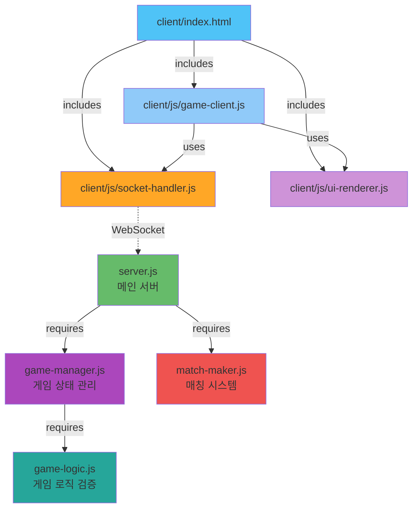

# Dependencies

## Current State: No Dependencies
현재 프로젝트는 외부 의존성이 전혀 없는 순수 HTML/CSS/JavaScript 애플리케이션입니다.

## Internal Dependencies
현재 시스템은 단일 파일로 구성되어 있어 내부 의존성이 없습니다.

```
index.html (standalone)
```

---

## Future Dependencies (멀티플레이어 구현)

### Internal Dependencies (Proposed Architecture)



### Server-Side Module Dependencies

#### server.js → game-manager.js
- **Type**: Runtime
- **Reason**: 게임 세션 생성 및 관리
- **Interface**: 
  - `createGame(player1Id, player2Id)`
  - `getGame(gameId)`
  - `updateGameState(gameId, newState)`
  - `endGame(gameId)`

#### server.js → match-maker.js
- **Type**: Runtime
- **Reason**: 플레이어 매칭 큐 관리
- **Interface**:
  - `addPlayerToQueue(playerId, socketId)`
  - `removePlayerFromQueue(playerId)`
  - `getMatchedPair()`

#### game-manager.js → game-logic.js
- **Type**: Runtime
- **Reason**: 게임 규칙 검증 및 판정
- **Interface**:
  - `createDeck()`
  - `shuffle(deck)`
  - `compareCards(card1, card2)`
  - `validateCardSubmission(gameState, playerId, cardIndex)`

### Client-Side Module Dependencies

#### game-client.js → socket-handler.js
- **Type**: Runtime
- **Reason**: 서버와의 WebSocket 통신
- **Interface**:
  - `connect()`
  - `emit(event, data)`
  - `on(event, callback)`
  - `disconnect()`

#### game-client.js → ui-renderer.js
- **Type**: Runtime
- **Reason**: UI 업데이트 및 렌더링
- **Interface**:
  - `updateGameState(state)`
  - `renderPlayerHand(cards)`
  - `renderBattleArea(playerCard, opponentCard)`
  - `showResult(result)`

---

## External Dependencies

### Production Dependencies

#### express (v4.18.0+)
- **Type**: Runtime
- **Purpose**: HTTP 서버 및 라우팅
- **License**: MIT
- **Usage**: 
  - 정적 파일 제공
  - Socket.io 서버 초기화
  - 기본 API 엔드포인트 (헬스체크 등)

#### socket.io (v4.6.0+)
- **Type**: Runtime
- **Purpose**: 실시간 양방향 통신
- **License**: MIT
- **Usage**:
  - 플레이어-서버 간 실시간 통신
  - 게임 이벤트 브로드캐스팅
  - 방(Room) 기반 1:1 매칭

#### socket.io-client (v4.6.0+)
- **Type**: Runtime (Client)
- **Purpose**: WebSocket 클라이언트
- **License**: MIT
- **Usage**:
  - 서버 연결
  - 이벤트 송수신
- **Note**: Socket.io 서버가 자동으로 제공 가능 (`/socket.io/socket.io.js`)

### Development Dependencies

#### nodemon (v3.0.0+)
- **Type**: Development
- **Purpose**: 서버 자동 재시작
- **License**: MIT
- **Usage**: 개발 중 코드 변경 시 자동 재시작

---

## Dependency Tree (Proposed)

### Server `package.json`
```json
{
  "name": "table-order-server",
  "version": "1.0.0",
  "dependencies": {
    "express": "^4.18.0",
    "socket.io": "^4.6.0"
  },
  "devDependencies": {
    "nodemon": "^3.0.0"
  }
}
```

**Transitive Dependencies** (자동으로 설치됨):
- `express` → `body-parser`, `cookie-parser`, `debug`, `finalhandler`, etc.
- `socket.io` → `socket.io-adapter`, `socket.io-parser`, `engine.io`, etc.

### Client (CDN or Bundled)
- **Option 1**: Socket.io 서버에서 제공 (추천)
  ```html
  <script src="/socket.io/socket.io.js"></script>
  ```
- **Option 2**: CDN 사용
  ```html
  <script src="https://cdn.socket.io/4.6.0/socket.io.min.js"></script>
  ```

---

## Dependency Security Considerations

### Current Risks
- ✅ 없음 (외부 의존성 없음)

### Future Risks (멀티플레이어)
- ⚠️ **npm 패키지 취약점**: 정기적인 `npm audit` 실행 필요
- ⚠️ **버전 고정**: `package-lock.json` 사용하여 의존성 버전 고정
- ⚠️ **보안 업데이트**: Express와 Socket.io 보안 패치 모니터링

### Mitigation Strategies
1. **정기 업데이트**: `npm update` 및 `npm audit fix`
2. **의존성 최소화**: 필요한 패키지만 설치
3. **신뢰할 수 있는 패키지**: 다운로드 수, 유지보수 상태 확인
4. **Automated Scanning**: GitHub Dependabot 또는 Snyk 사용

---

## Build Dependencies (None for MVP)

현재는 빌드 프로세스가 없으므로 빌드 도구 의존성이 없습니다.

### Future Consideration (Optional)
향후 프로젝트 성장 시 고려:
- **Webpack** 또는 **Vite**: 번들링
- **Babel**: ES6+ 트랜스파일링 (레거시 브라우저 지원)
- **TypeScript**: 타입 안전성

---

## Dependency Installation Guide

### Prerequisites
- **Node.js**: v18+ (LTS 권장)
- **npm**: v9+ (Node.js와 함께 설치됨)

### Installation Steps
```bash
# 1. 서버 디렉토리 생성
mkdir server && cd server

# 2. package.json 초기화
npm init -y

# 3. 프로덕션 의존성 설치
npm install express socket.io

# 4. 개발 의존성 설치
npm install --save-dev nodemon

# 5. 의존성 확인
npm list --depth=0
```

### Expected Output
```
server@1.0.0 /path/to/server
├── express@4.18.x
├── socket.io@4.6.x
└── nodemon@3.0.x (dev)
```

---

## Dependency Update Strategy

### Semantic Versioning
- **Major** (X.0.0): Breaking changes - 수동 업데이트 및 테스트 필요
- **Minor** (0.X.0): 새 기능 추가 - 일반적으로 안전
- **Patch** (0.0.X): 버그 수정 - 자동 업데이트 권장

### Update Commands
```bash
# 취약점 확인
npm audit

# 취약점 자동 수정
npm audit fix

# 패키지 업데이트 (minor/patch only)
npm update

# 특정 패키지 최신 버전 설치
npm install express@latest
```

---

## Zero Dependency Alternative (Not Recommended)

WebSocket 없이 구현 가능한 대안 (권장하지 않음):
- **Long Polling**: HTTP 기반 폴링 (비효율적)
- **Server-Sent Events (SSE)**: 단방향 통신만 가능
- **Native WebSocket API**: Socket.io의 편의 기능 없음 (재연결, 방 관리 등)

**결론**: Socket.io 사용이 멀티플레이어 게임에 최적
