# Interaction Diagrams

## Overview
이 문서는 카드 배틀 게임의 주요 비즈니스 트랜잭션이 컴포넌트 간에 어떻게 구현되는지 시각화합니다.

---

## 1. 게임 시작 (Game Initialization)

### Sequence Diagram

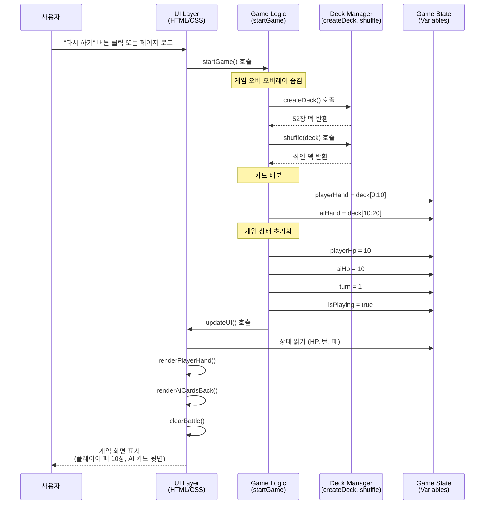

### Component Flow

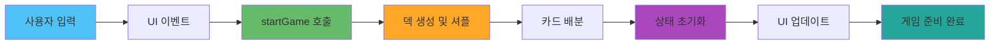

---

## 2. 카드 제출 및 배틀 (Card Submission & Battle)

### Sequence Diagram

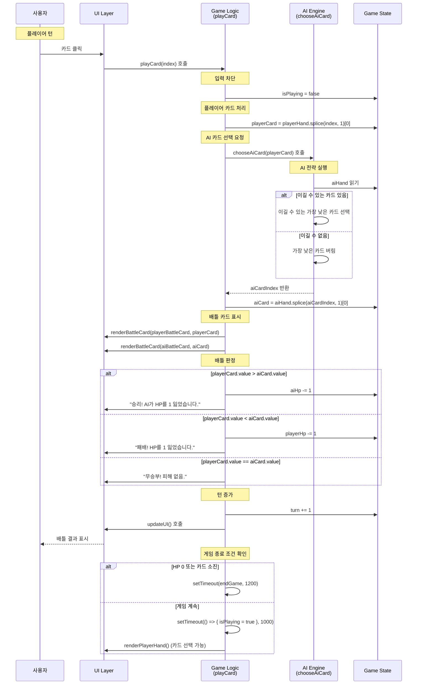

### Component Flow

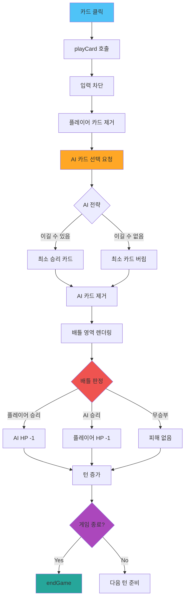

---

## 3. AI 카드 선택 전략 (AI Strategy Execution)

### Decision Flow

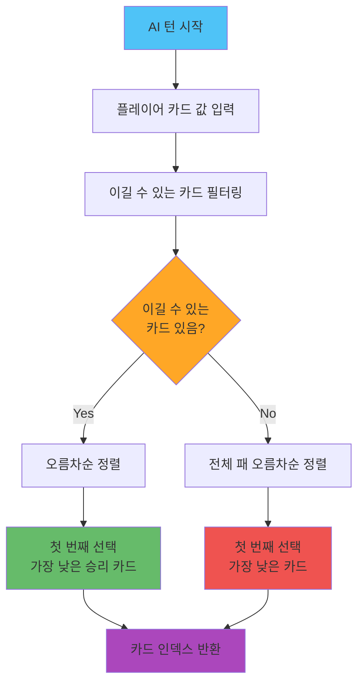

### Strategy Logic Breakdown

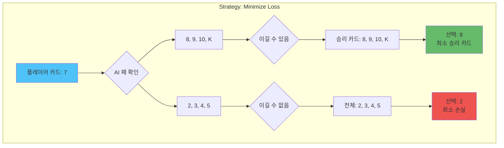

---

## 4. 게임 종료 (Game End)

### Sequence Diagram

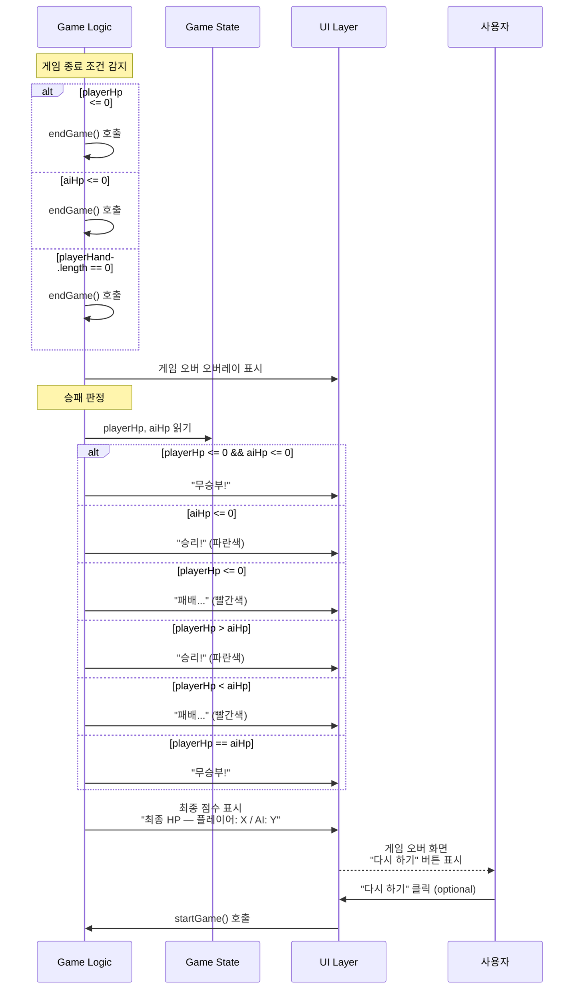

### End Condition Decision Tree

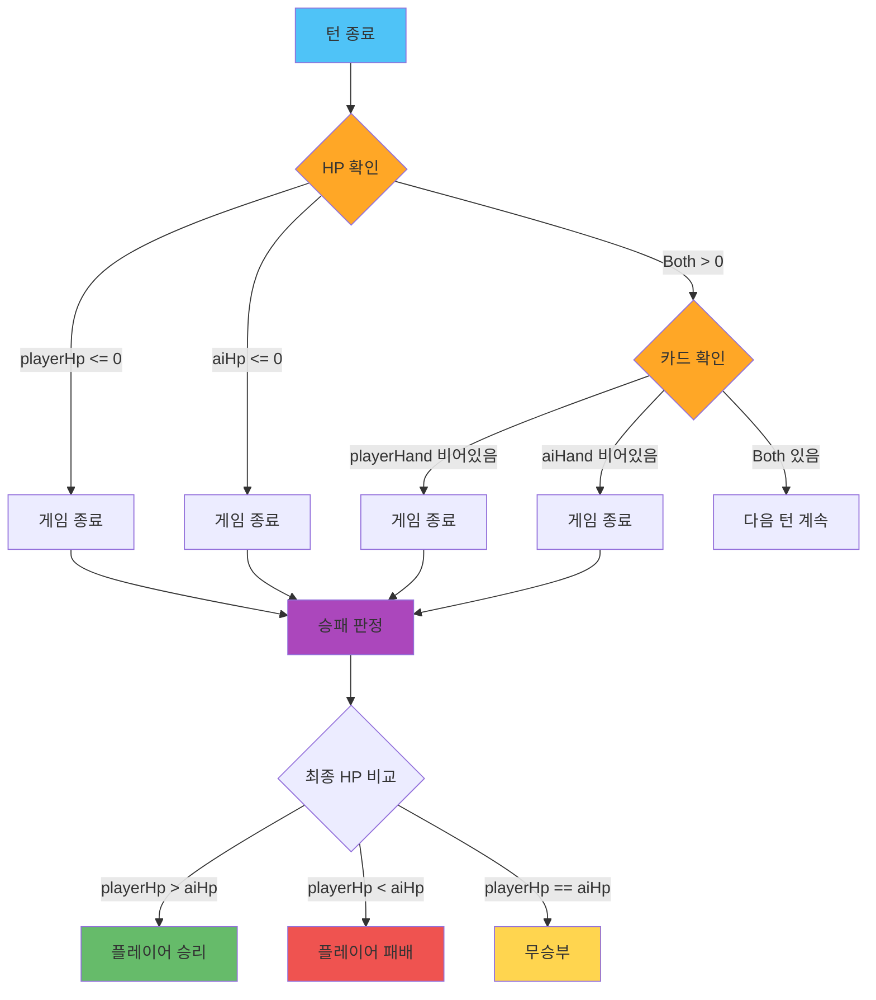

---

## 5. UI 업데이트 플로우 (UI Update Flow)

### Data Flow Diagram

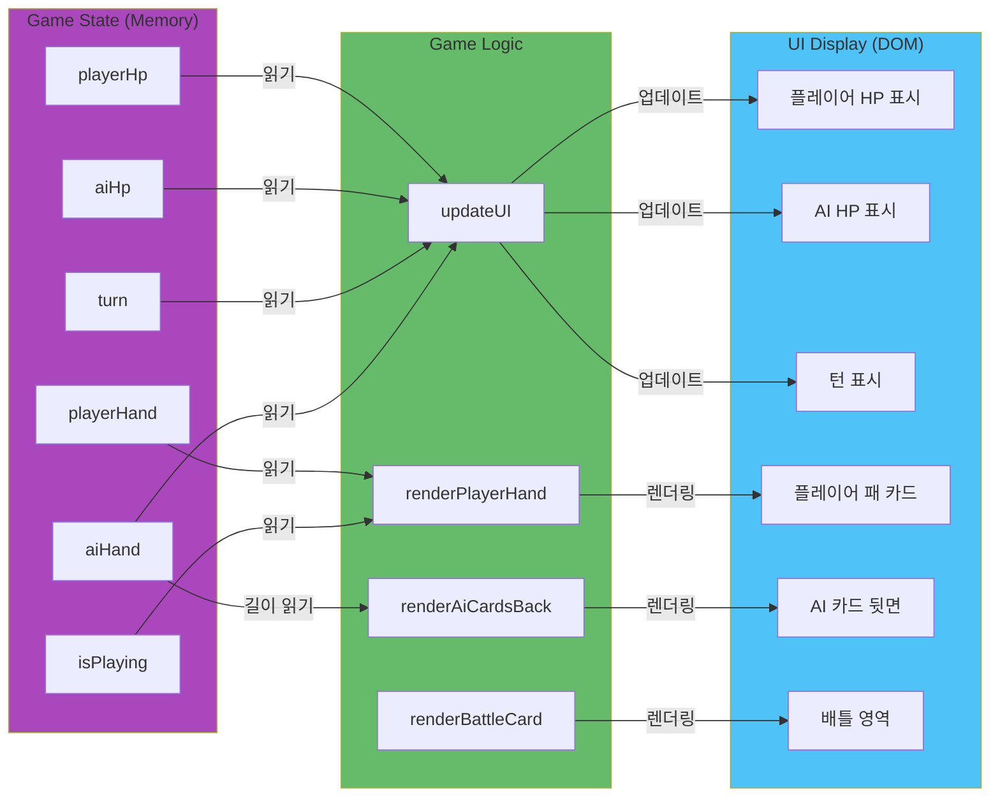

---

## 6. 전체 게임 플로우 (Complete Game Flow)

### High-Level State Machine

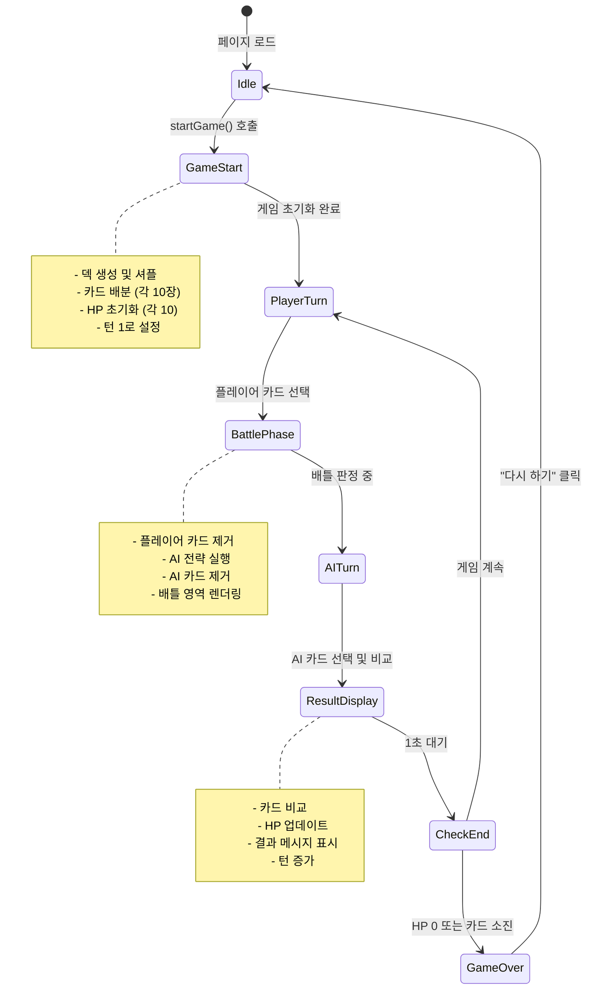

---

## 7. 멀티플레이어 전환 시 예상 플로우 (Future Multiplayer Flow)

### Proposed Multiplayer Sequence

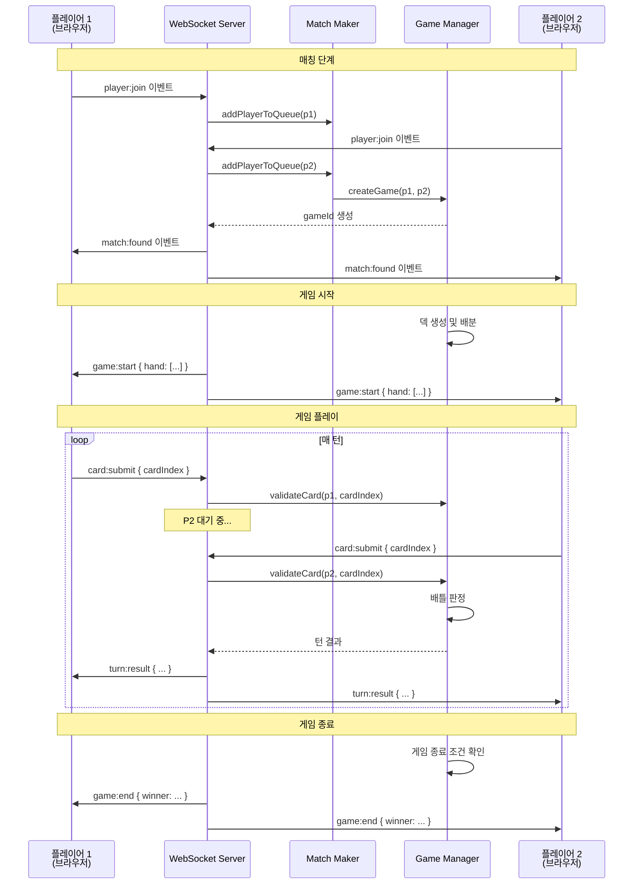

### Multiplayer Component Interaction

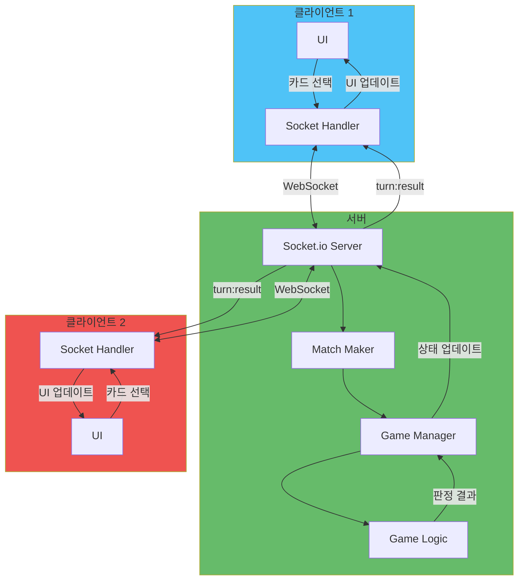

---

## Summary

이 문서는 다음 비즈니스 트랜잭션의 구현 방식을 시각화했습니다:

1. ✅ **게임 시작**: 덱 생성 → 카드 배분 → 상태 초기화 → UI 렌더링
2. ✅ **카드 제출 및 배틀**: 플레이어 선택 → AI 전략 → 배틀 판정 → 결과 표시
3. ✅ **AI 전략**: 승리 가능성 확인 → 최적 카드 선택
4. ✅ **게임 종료**: 종료 조건 확인 → 승패 판정 → 결과 화면
5. ✅ **UI 업데이트**: 상태 읽기 → DOM 업데이트
6. ✅ **전체 플로우**: 상태 머신으로 게임 흐름 정의
7. 📋 **멀티플레이어 예상 플로우**: 향후 구현 시 참고용
